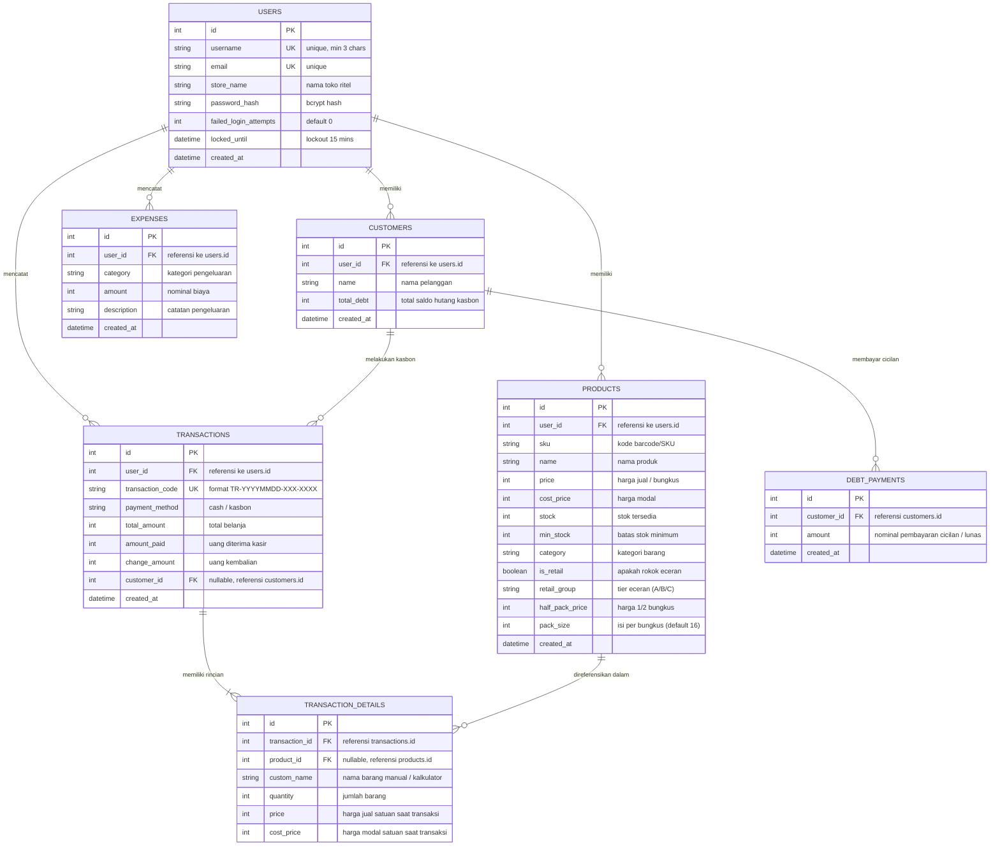

# Entity Relationship Diagram (ERD) - CASHIER

Dokumentasi rancangan basis data relasional (Database Schema & ERD) untuk sistem **CASHIER** (Kasir Ritel, Inventaris, Buku Kasbon, dan Pengeluaran).

---

## 📊 Diagram Visual ERD (Mermaid)

---

## 🗄️ Kamus Data (Data Dictionary)

### 1. Tabel `users`
Menyimpan akun pengguna / toko dengan sistem isolasi data (*multi-tenant*).

| Kolom | Tipe Data | Nullable | Default | Keterangan |
| :--- | :--- | :---: | :---: | :--- |
| `id` | `INTEGER` | ❌ No | *Auto Increment* | **Primary Key** |
| `username` | `VARCHAR(80)` | ❌ No | - | Nama login pengguna (**Unique**) |
| `email` | `VARCHAR(120)` | ❌ No | - | Alamat email terdaftar (**Unique**) |
| `store_name` | `VARCHAR(150)` | ✔️ Yes | `'Toko Ritel'` | Nama toko ritel yang ditampilkan di struk & header |
| `password_hash` | `VARCHAR(255)` | ❌ No | - | Kata sandi terenkripsi (Bcrypt) |
| `failed_login_attempts`| `INTEGER` | ❌ No | `0` | Jumlah kegagalan login berturut-turut |
| `locked_until` | `DATETIME` | ✔️ Yes | `NULL` | Waktu kunci akun (15 menit jika 5x gagal) |
| `created_at` | `DATETIME` | ❌ No | `CURRENT_TIMESTAMP` | Waktu pendaftaran akun |

---

### 2. Tabel `products`
Menyimpan data katalog produk/barang, stok, batas minimum, serta kalkulasi eceran rokok (*tiered pricing*).

| Kolom | Tipe Data | Nullable | Default | Keterangan |
| :--- | :--- | :---: | :---: | :--- |
| `id` | `INTEGER` | ❌ No | *Auto Increment* | **Primary Key** |
| `user_id` | `INTEGER` | ✔️ Yes | `NULL` | **Foreign Key** `users(id)` |
| `sku` | `VARCHAR(100)` | ✔️ Yes | `NULL` | Kode barcode / SKU produk |
| `name` | `VARCHAR(255)` | ❌ No | - | Nama produk / barang |
| `price` | `INTEGER` | ❌ No | - | Harga jual per unit / per bungkus (Rp) |
| `cost_price` | `INTEGER` | ❌ No | - | Harga modal / beli (Rp) |
| `stock` | `INTEGER` | ❌ No | `0` | Jumlah stok yang tersedia |
| `min_stock` | `INTEGER` | ❌ No | `5` | Batas peringatan stok menipis |
| `category` | `VARCHAR(100)` | ❌ No | `'Lainnya'` | Kategori barang (Makanan, Minuman, Rokok, dll) |
| `is_retail` | `BOOLEAN` | ❌ No | `FALSE` | `TRUE` jika produk dapat diecer per batang/kelipatan |
| `retail_group` | `VARCHAR(10)` | ✔️ Yes | `NULL` | Golongan harga eceran (`'A'`, `'B'`, atau `'C'`) |
| `half_pack_price` | `INTEGER` | ✔️ Yes | `NULL` | Harga spesial 1/2 bungkus |
| `pack_size` | `INTEGER` | ✔️ Yes | `16` | Jumlah batang per bungkus |
| `created_at` | `DATETIME` | ❌ No | `CURRENT_TIMESTAMP` | Waktu penambahan produk |

---

### 3. Tabel `customers`
Menyimpan data buku kasbon pelanggan dan saldo piutang aktif.

| Kolom | Tipe Data | Nullable | Default | Keterangan |
| :--- | :--- | :---: | :---: | :--- |
| `id` | `INTEGER` | ❌ No | *Auto Increment* | **Primary Key** |
| `user_id` | `INTEGER` | ✔️ Yes | `NULL` | **Foreign Key** `users(id)` |
| `name` | `VARCHAR(255)` | ❌ No | - | Nama lengkap pelanggan |
| `total_debt` | `INTEGER` | ❌ No | `0` | Sisa total tagihan kasbon aktif (Rp) |
| `created_at` | `DATETIME` | ❌ No | `CURRENT_TIMESTAMP` | Waktu pendaftaran pelanggan |

---

### 4. Tabel `transactions`
Menyimpan *header* transaksi penjualan kasir (pembayaran tunai maupun kasbon).

| Kolom | Tipe Data | Nullable | Default | Keterangan |
| :--- | :--- | :---: | :---: | :--- |
| `id` | `INTEGER` | ❌ No | *Auto Increment* | **Primary Key** |
| `user_id` | `INTEGER` | ✔️ Yes | `NULL` | **Foreign Key** `users(id)` |
| `transaction_code` | `VARCHAR(100)` | ❌ No | - | Kode nota transaksi (**Unique**), e.g. `TR-20260907-001-0001` |
| `payment_method` | `VARCHAR(50)` | ❌ No | - | Metode pembayaran: `'cash'` atau `'kasbon'` |
| `total_amount` | `INTEGER` | ❌ No | - | Total belanja keseluruhan (Rp) |
| `amount_paid` | `INTEGER` | ❌ No | `0` | Nominal uang tunai yang dibayarkan pelanggan |
| `change_amount` | `INTEGER` | ❌ No | `0` | Nominal kembalian yang diberikan |
| `customer_id` | `INTEGER` | ✔️ Yes | `NULL` | **Foreign Key** `customers(id)` (wajib jika kasbon) |
| `created_at` | `DATETIME` | ❌ No | `CURRENT_TIMESTAMP` | Waktu transaksi dibuat |

---

### 5. Tabel `transaction_details`
Menyimpan rincian item per baris pada setiap transaksi, baik barang katalog maupun barang manual/kalkulator.

| Kolom | Tipe Data | Nullable | Default | Keterangan |
| :--- | :--- | :---: | :---: | :--- |
| `id` | `INTEGER` | ❌ No | *Auto Increment* | **Primary Key** |
| `transaction_id` | `INTEGER` | ❌ No | - | **Foreign Key** `transactions(id)` *(Cascade Delete)* |
| `product_id` | `INTEGER` | ✔️ Yes | `NULL` | **Foreign Key** `products(id)` (null jika barang manual) |
| `custom_name` | `VARCHAR(255)` | ✔️ Yes | `NULL` | Nama barang manual dari kalkulator input |
| `quantity` | `INTEGER` | ❌ No | - | Jumlah kuantitas yang dibeli |
| `price` | `INTEGER` | ❌ No | - | Harga jual satuan saat transaksi berlangsung |
| `cost_price` | `INTEGER` | ❌ No | `0` | Harga modal satuan saat transaksi berlangsung |

---

### 6. Tabel `debt_payments`
Menyimpan catatan riwayat pembayaran cicilan / pelunasan piutang kasbon oleh pelanggan.

| Kolom | Tipe Data | Nullable | Default | Keterangan |
| :--- | :--- | :---: | :---: | :--- |
| `id` | `INTEGER` | ❌ No | *Auto Increment* | **Primary Key** |
| `customer_id` | `INTEGER` | ❌ No | - | **Foreign Key** `customers(id)` |
| `amount` | `INTEGER` | ❌ No | - | Nominal pembayaran yang diterima kasir (Rp) |
| `created_at` | `DATETIME` | ❌ No | `CURRENT_TIMESTAMP` | Waktu pembayaran kasbon |

---

### 7. Tabel `expenses`
Menyimpan catatan pengeluaran kas operasional toko (arus kas keluar).

| Kolom | Tipe Data | Nullable | Default | Keterangan |
| :--- | :--- | :---: | :---: | :--- |
| `id` | `INTEGER` | ❌ No | *Auto Increment* | **Primary Key** |
| `user_id` | `INTEGER` | ✔️ Yes | `NULL` | **Foreign Key** `users(id)` |
| `category` | `VARCHAR(100)` | ❌ No | - | Kategori (Kue-kue, Belanja Harian, Makan Karyawan, dll) |
| `amount` | `INTEGER` | ❌ No | - | Nominal biaya pengeluaran (Rp) |
| `description` | `VARCHAR(255)` | ✔️ Yes | `NULL` | Catatan / rincian pengeluaran |
| `created_at` | `DATETIME` | ❌ No | `CURRENT_TIMESTAMP` | Waktu pencatatan pengeluaran |

---

## 🔄 Aturan Bisnis & Integritas Relasi (Business Logic Rules)

1. **Multi-Tenancy Isolation**:
   - Setiap tabel utama (`products`, `customers`, `transactions`, `expenses`) memiliki foreign key `user_id`. Setiap user toko hanya dapat melihat dan mengelola datanya sendiri.
2. **Arus Kas Masuk vs Piutang**:
   - Transaksi dengan `payment_method = 'cash'` langsung dihitung sebagai **Pemasukan Kas**.
   - Transaksi dengan `payment_method = 'kasbon'` **TIDAK** dihitung ke pemasukan kas melainkan menambah `Customer.total_debt` (Piutang).
   - Pembayaran hutang pada `debt_payments` dicatat sebagai **Pemasukan Kas (Arus Kas Masuk)** dan mengurangi `Customer.total_debt`.
3. **Fleksibilitas Item Keranjang**:
   - `transaction_details.product_id` bersifat opsional (*nullable*). Jika transaksi berasal dari fitur kalkulator barang manual, `custom_name` diisi dengan nama barang yang diinput kasir tanpa mengurangi stok produk katalog.
