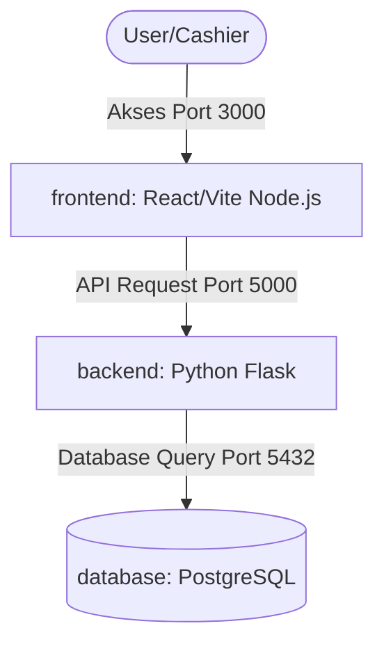

# Spesifikasi Desain: Website Kasir, Inventaris, dan Kasbon Ritel

Dokumen ini mendokumentasikan spesifikasi teknis untuk pengembangan sistem Kasir Ritel terintegrasi dengan pelacakan stok otomatis (inventaris) dan sistem pencatatan utang kasbon sederhana.

## 1. Arsitektur Sistem

Aplikasi ini menggunakan arsitektur *decoupled* yang dideploy menggunakan **Docker Compose**:

*   **Frontend**: React (Vite) berjalan di Node.js, menyajikan antarmuka kasir (POS Grid). Port: `3000`.
*   **Backend**: Python Flask REST API, mengelola logika bisnis, autentikasi, transaksi, dan notifikasi. Port: `5000`.
*   **Database**: PostgreSQL, menyimpan seluruh data persisten secara aman. Port: `5432`.



---

## 2. Skema Database & Model Data (PostgreSQL via SQLAlchemy)

### 2.1 Model `User` (Admin Kasir)
Menyimpan kredensial admin tunggal untuk autentikasi sistem.
*   `id` (Integer, Primary Key)
*   `username` (String, Unique, Not Null)
*   `password_hash` (String, Not Null)
*   `created_at` (DateTime, Default: CURRENT_TIMESTAMP)

### 2.2 Model `Product` (Inventaris Barang)
Menyimpan data produk ritel beserta informasi stok.
*   `id` (Integer, Primary Key)
*   `sku` (String, Unique, Nullable)
*   `name` (String, Not Null)
*   `price` (Integer, Not Null) - *Harga jual ke konsumen*
*   `cost_price` (Integer, Not Null) - *Harga modal pembelian barang*
*   `stock` (Integer, Not Null, Default: 0)
*   `min_stock` (Integer, Not Null, Default: 5) - *Batas minimum stok untuk memicu alert*
*   `created_at` (DateTime, Default: CURRENT_TIMESTAMP)

### 2.3 Model `Customer` (Kasbon Pelanggan)
Menyimpan profil pelanggan ritel yang melakukan kasbon beserta nominal utang berjalan.
*   `id` (Integer, Primary Key)
*   `name` (String, Unique, Not Null)
*   `total_debt` (Integer, Default: 0) - *Saldo utang aktif pelanggan*
*   `created_at` (DateTime, Default: CURRENT_TIMESTAMP)

### 2.4 Model `Transaction` (Transaksi Penjualan)
Mencatat informasi transaksi umum di kasir.
*   `id` (Integer, Primary Key)
*   `transaction_code` (String, Unique, Not Null) - *Format: TR-YYYYMMDD-XXXX*
*   `payment_method` (String, Not Null) - *Nilai: 'cash', 'debit', atau 'kasbon'*
*   `total_amount` (Integer, Not Null)
*   `amount_paid` (Integer, Not Null) - *Nominal uang kas/debit yang diserahkan*
*   `change_amount` (Integer, Not Null) - *Kembalian untuk transaksi tunai*
*   `customer_id` (Integer, ForeignKey('customer.id'), Nullable)
*   `created_at` (DateTime, Default: CURRENT_TIMESTAMP)

### 2.5 Model `TransactionDetail` (Item Transaksi)
Mencatat barang apa saja yang dibeli di setiap transaksi berserta harga pada saat transaksi terjadi.
*   `id` (Integer, Primary Key)
*   `transaction_id` (Integer, ForeignKey('transaction.id'), Not Null)
*   `product_id` (Integer, ForeignKey('product.id'), Not Null)
*   `quantity` (Integer, Not Null)
*   `price` (Integer, Not Null) - *Harga jual produk saat transaksi dilakukan*
*   `cost_price` (Integer, Not Null) - *Harga modal produk saat transaksi dilakukan (untuk laporan profit)*

### 2.6 Model `DebtPayment` (Pembayaran Kasbon)
Mencatat riwayat angsuran/pelunasan kasbon pelanggan.
*   `id` (Integer, Primary Key)
*   `customer_id` (Integer, ForeignKey('customer.id'), Not Null)
*   `amount` (Integer, Not Null) - *Jumlah uang yang dibayarkan pelanggan*
*   `created_at` (DateTime, Default: CURRENT_TIMESTAMP)

---

## 3. Spesifikasi API Endpoints

Semua request dan response API bertipe JSON dengan prefiks url `/api`.

### 3.1 Autentikasi & Keamanan JWT
*   **Mekanisme JWT**: 
    *   Setelah login sukses, backend mengembalikan token JWT yang ditandatangani menggunakan `HMAC-SHA256` dengan kunci rahasia (`JWT_SECRET_KEY` di `.env`).
    *   Semua endpoint API selain `/api/auth/login` wajib dilindungi (*protected*). Frontend harus mengirimkan token JWT di header HTTP request: `Authorization: Bearer <JWT_TOKEN>`.
    *   Backend Flask memvalidasi tanda tangan JWT dan masa kedaluwarsa (default: 24 jam) menggunakan decorator `@token_required`. Jika token tidak ada atau tidak valid/kedaluwarsa, Flask mengembalikan status `401 Unauthorized` dengan JSON: `{"error": "Token autentikasi tidak valid atau sudah kedaluwarsa"}`.
*   `POST /api/auth/login`
    *   *Request*: `{"username": "admin", "password": "password123"}`
    *   *Response (Success)*: `{"token": "JWT_TOKEN_STRING"}`
*   `POST /api/auth/logout`
    *   *Response*: `{"message": "Logout sukses"}`

### 3.2 Manajemen Produk
*   `GET /api/products` -> Mendapatkan seluruh produk.
*   `POST /api/products` -> Membuat produk baru.
    *   *Request*: `{"sku": "12345", "name": "Beras 1kg", "price": 15000, "cost_price": 12000, "stock": 50, "min_stock": 10}`
*   `PUT /api/products/<id>` -> Mengedit produk.
*   `DELETE /api/products/<id>` -> Menghapus produk.

### 3.3 Transaksi Kasir
*   `POST /api/transactions`
    *   *Request*:
        ```json
        {
          "payment_method": "kasbon",
          "customer_id": 3,
          "amount_paid": 0,
          "items": [
            {"product_id": 1, "quantity": 2},
            {"product_id": 2, "quantity": 1}
          ]
        }
        ```
    *   *Logika*:
        1. Memeriksa kecukupan stok masing-masing produk. Jika tidak mencukupi, transaksi dibatalkan dengan response `400 Bad Request`.
        2. Menyimpan data transaksi ke tabel `Transaction` dan detailnya ke `TransactionDetail`.
        3. Memotong stok produk di tabel `Product`.
        4. Jika `payment_method` adalah `kasbon`, menambah kolom `total_debt` pelanggan di tabel `Customer` senilai total belanja.
        5. Memeriksa apakah setelah dipotong, stok produk jatuh di bawah `min_stock` untuk peringatan stok menipis di Dashboard/Inventaris.
        6. Mengembalikan data transaksi yang berhasil disimpan.

### 3.4 Pelanggan & Kasbon
*   `GET /api/customers` -> Mendapatkan seluruh profil pelanggan beserta nilai utangnya.
*   `POST /api/customers` -> Membuat profil pelanggan baru `{"name": "Nama Pelanggan"}`.
*   `POST /api/customers/<id>/pay-debt` -> Membayar kasbon.
    *   *Request*: `{"amount": 50000}`
    *   *Logika*: Mencatat pembayaran di tabel `DebtPayment`, dan mengurangi nilai `total_debt` pada tabel `Customer` dengan `amount` tersebut.

### 3.5 Laporan Keuangan (Bookkeeping)
*   `GET /api/reports/summary`
    *   *Response*:
        ```json
        {
          "total_income": 1250000,
          "total_receivables": 350000,
          "recent_movements": [
            {"type": "sale", "description": "Penjualan TR-20260823-001", "amount": 150000, "created_at": "2026-08-23T20:00:00Z"},
            {"type": "debt_payment", "description": "Pembayaran Kasbon - Budi", "amount": 50000, "created_at": "2026-08-23T20:15:00Z"}
          ]
        }
        ```

---

## 4. Antarmuka Pengguna (Frontend UI)

Frontend dirancang responsif menggunakan Tailwind CSS dengan layout Sidebar navigasi tetap:

1.  **Halaman Kasir (POS)**:
    *   Panel Kiri: Grid kartu produk yang menampilkan nama produk, harga jual, dan sisa stok. Ditambah input pencarian produk di bagian atas.
    *   Panel Kanan (Sidebar Cart): Menampilkan daftar item belanja saat ini beserta kuantitasnya, total harga belanja, input jumlah uang bayar (jika tunai), dropdown pemilih pelanggan (jika metode kasbon), dan tombol checkout.
2.  **Halaman Inventaris**:
    *   Tabel produk ritel dengan kolom: SKU, Nama Produk, Harga Modal, Harga Jual, Stok Saat Ini, Batas Minimum Stok, dan Aksi (Edit/Hapus).
    *   Produk dengan stok kritis (`stock` < `min_stock`) akan ditandai dengan baris/badge merah terang.
    *   Tombol "Tambah Barang Baru" yang membuka formulir isian produk.
3.  **Halaman Kasbon**:
    *   Tabel pelanggan dengan kolom: Nama Pelanggan, Total Utang Kasbon, dan Aksi (Bayar Kasbon).
    *   Tombol "Tambah Pelanggan Baru".
    *   Tombol "Bayar Kasbon" akan memunculkan modal dialog untuk menginput nominal pembayaran kasbon pelanggan tersebut.
4.  **Halaman Laporan**:
    *   Kartu Summary: (1) Total Pemasukan Bersih, (2) Total Piutang Aktif (Jumlah kasbon berjalan semua pelanggan).
    *   Tabel arus kas masuk berdasarkan urutan waktu.

---

## 5. Notifikasi & Peringatan Stok

*   Notifikasi stok menipis ditampilkan secara langsung pada antarmuka Dashboard dan Halaman Inventaris ketika jumlah stok berada di bawah batas minimum (`stock < min_stock`).

## 6. Penanganan Kesalahan (Error Handling)

*   **Validasi Inventaris**: Jika stok tidak mencukupi untuk item belanja yang diajukan di kasir, backend mengembalikan status `400 Bad Request` dengan payload `{"error": "Stok barang 'X' tidak mencukupi."}` dan membatalkan seluruh penulisan database (rollback).
*   **Keamanan Transaksi Database**: Seluruh proses checkout (pemotongan stok produk, penambahan catatan transaksi, pencatatan kasbon pelanggan) dijalankan di dalam satu *transaction block* yang aman. Jika terjadi galat di tengah jalan, seluruh operasi di-*rollback*.
*   **Umpan Balik Visual**: Frontend akan menampilkan pesan kesalahan (error alert) yang intuitif ketika server offline atau ketika terjadi kesalahan input data.
