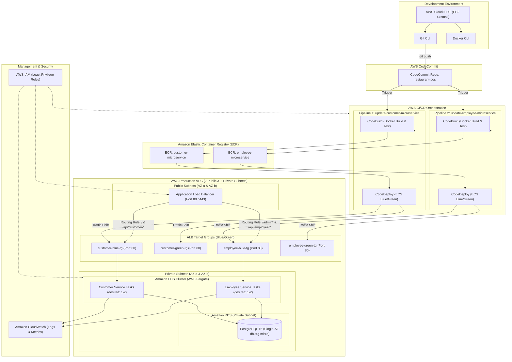
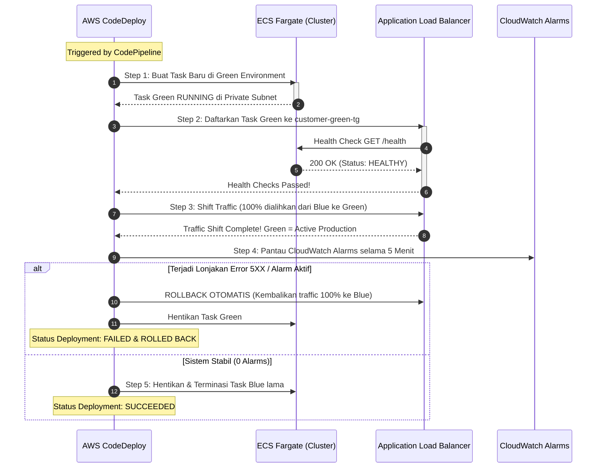

# Master Blueprint & Spesifikasi Arsitektur: Sistem POS Restoran AWS Microservices & CI/CD
## Kategori Evaluasi: AWS Academy Lab Project – Nilai Target: Luar Biasa (Exceptional)

---

## TAHAP 1 & 2: Audit Project Saat Ini & Analisis Kesenjangan (Gap Analysis)

### 1. Perbandingan Kondisi Repositori Saat Ini vs Target Rubrik "Luar Biasa"

| Komponen Rubrik | Kondisi Saat Ini (Existing Repo) | Target Rubrik "Luar Biasa" | Kesenjangan (Gap) & Aksi yang Diperlukan |
|:---|:---|:---|:---|
| **Pemisahan Microservices** | Monolitik (1 Backend Flask + 1 Frontend React terpadu). | Minimal 2 Microservices terpisah secara domain: `customer-microservice` & `employee-microservice`. | Pecah backend & frontend menjadi 2 folder mandiri dengan domain boundary ketat. Hapus kode silang antar service. |
| **Portabilitas & Docker** | 1 Dockerfile frontend, 1 Dockerfile backend lokal via `docker-compose`. | Setiap microservice memiliki Dockerfile mandiri, sukses di-build lokal, di-push ke ECR, dan dideploy ke ECS. | Buat 2 Dockerfile mandiri (multi-stage build), siapkan script build & push ke 2 ECR repository berbeda. |
| **Container Orchestration** | Docker Compose lokal (laptop/VM). | **Amazon ECS dengan AWS Fargate** (Serverless Container). | Buat 2 ECS Task Definitions (`customer-task-def`, `employee-task-def`) dan 2 ECS Services di ECS Cluster. |
| **Database Production** | PostgreSQL lokal via Docker Container. | **Amazon RDS PostgreSQL** (Managed Database). | Konfigurasi connection string backend ke RDS Endpoint; migrasi skema tabel POS tanpa modul inventaris/kasbon. |
| **Load Balancer & Routing** | Port binding langsung (Port 3000 & 5000). | **Application Load Balancer (ALB)** dengan Path Routing (`/` & `/api/customer/*` vs `/admin` & `/api/employee/*`). | Buat ALB Internet-Facing dengan listener rule berbasis path; pastikan tidak terjadi 404 pada route `/admin`. |
| **Blue/Green Deployment** | Tidak ada (restart container lokal). | **AWS CodeDeploy** dengan **4 Target Groups** (2 Blue, 2 Green) & automated traffic shifting. | Konfigurasi `customer-blue-tg`, `customer-green-tg`, `employee-blue-tg`, `employee-green-tg` dan file `appspec.yaml`. |
| **Source Control** | Git lokal. | **AWS CodeCommit** (Repository `restaurant-pos`). | Push source code ke remote CodeCommit repository. |
| **Pipeline Otomasi CI/CD** | Tidak ada pipeline CI/CD. | **2 Pipeline AWS CodePipeline terpisah**: `update-customer-microservice` & `update-employee-microservice`. | Konfigurasi 2 pipeline otomatis yang terpicu saat ada commit baru, melakukan build Docker, push ke ECR, dan trigger CodeDeploy. |
| **Monitoring & Logging** | Console terminal stdout. | **Amazon CloudWatch** (Log Groups untuk ECS Tasks, CodeBuild, dan CloudWatch Alarms). | Integrasikan driver log `awslogs` pada ECS Task Definition ke log groups `/ecs/customer-microservice` dan `/ecs/employee-microservice`. |
| **Hak Akses & Keamanan** | Tidak ada IAM (akses lokal). | **AWS IAM** dengan prinsip **Least Privilege** untuk setiap komponen. | Buat role spesifik: `ECSTaskExecutionRole`, `ECSTaskRole`, `CodePipelineRole`, `CodeDeployRole`, `CodeBuildRole`. |
| **Skalabilitas & Ketahanan** | Statis 1 instans. | Pengujian horizontal scaling via `aws ecs update-service --desired-count 2` dan verifikasi target group healthy. | Lakukan uji perintah CLI, verifikasi task kedua berjalan healthy di target group ALB. |
| **Optimasi Biaya (FinOps)** | Belum ada. | **Estimasi biaya komprehensif 12 Bulan** mencakup 7 layanan wajib AWS. | Buat tabel estimasi biaya 12 bulan berbasis AWS Pricing Calculator (Region us-east-1). |
| **Business Logic POS** | Skema lama (kasir ritel, rokok eceran, kasbon). | Restoran 3-Role (Admin, Kasir, Pelanggan), Table Lock, Cash/Cashless, HPP, Omzet, Profit. | Gunakan dokumen spesifikasi 2026-10-05 sebagai source of truth logika bisnis. Hapus seluruh sisa tabel inventaris/kasbon. |

---

## TAHAP 3: Pemetaan Rubrik → Requirement → Implementasi → Bukti

| Kriteria Rubrik | Requirement Teknis | Langkah Implementasi | Bukti Artefak / Pengujian |
|:---|:---|:---|:---|
| **Arsitektur Cloud Lengkap** | Menampilkan 9 layanan: Cloud9, CodeCommit, CodePipeline, CodeDeploy, ECR, ECS Fargate, RDS, CloudWatch, IAM + ALB. | Susun arsitektur VPC, subnetting publik/privat, dan diagram integrasi 9 layanan. | Diagram arsitektur visual & screenshot AWS Console aktif untuk setiap service. |
| **Arsitektur Microservices** | 2 container terpisah secara fungsional (`customer-microservice` & `employee-microservice`). | Pisahkan kode menjadi 2 folder terisolasi; masing-masing memiliki endpoint API dan UI statisnya sendiri. | `docker ps` menunjukkan 2 container berbeda port & log ECS task terpisah di CloudWatch. |
| **Portabilitas & ECR** | Docker build lokal sukses, push ke ECR, ECS deploy dari ECR terbaru. | Buat Dockerfile multi-stage; jalankan build lokal; buat script autentikasi dan push ke ECR. | Screenshot repository ECR memuat tag commit hash dan digest image terbaru. |
| **ALB & 4 Target Groups** | 1 ALB melayani 4 Target Groups (Customer Blue/Green, Employee Blue/Green) tanpa error 404. | Daftarkan listener port 80; buat 4 target group; pasang routing rule `/` dan `/admin`. | Screenshot ALB console (Listeners & Rules, 4 Target Groups dengan status "Healthy"). |
| **Blue/Green Deployment** | CodeDeploy menggeser traffic dari Blue ke Green setelah lolos health check; ada rollback otomatis. | Siapkan `appspec.yaml` dan `taskdef.json`; set deployment group ECS; demonstrasikan rollback. | Screenshot CodeDeploy Deployment Lifecycle (Step 1 s/d Step 5) & grafik pergeseran traffic ALB. |
| **Dua Pipeline CI/CD** | Minimal 2 pipeline terpisah dan **keduanya berhasil dijalankan minimal satu kali**. | Buat pipeline `update-customer-microservice` dan `update-employee-microservice` di CodePipeline. | Screenshot status "Succeeded" hijau pada kedua pipeline di AWS CodePipeline Console. |
| **Otomasi Pengujian CI/CD** | Push git ke CodeCommit secara otomatis memicu pipeline hingga live di production tanpa intervensi manual. | Lakukan perubahan kecil pada kode employee, `git commit` dan `git push` ke CodeCommit; biarkan pipeline berjalan. | Riwayat commit CodeCommit terhubung dengan Execution ID CodePipeline yang sukses. |
| **Skalabilitas ECS Fargate** | Ubah task count dari 1 menjadi 2 menggunakan CLI AWS. | Eksekusi `aws ecs update-service --desired-count 2` dan cek status task. | Output terminal CLI `aws ecs update-service` dan screenshot ECS Console menunjukkan 2 task RUNNING. |
| **Optimasi Biaya 12 Bulan** | Estimasi biaya 12 bulan mencakup Cloud9/EC2, RDS, ECR, ECS, ALB, CodeDeploy, CodePipeline. | Hitung menggunakan AWS Pricing Calculator dengan rincian konfigurasi realistis dan asumsi hemat biaya. | Dokumen tabel kalkulasi biaya 12 bulan beserta asumsi operasional. |
| **Integritas RBAC & POS** | 3 Role (Admin, Kasir, Pelanggan) berfungsi dengan proteksi backend; table lock & snapshot harga aktif. | Implementasi JWT role guard decorator di backend; server recalculation untuk cash & cashless. | Bukti penolakan akses (403 Forbidden) saat customer membuka `/admin` dan struk cash dengan kembalian valid. |

---

## TAHAP 4: Struktur Microservices Final

Struktur repository tunggal (`restaurant-pos`) yang didekomposisi bersih:

```
restaurant-pos/
├── customer-microservice/
│   ├── Dockerfile
│   ├── appspec.yaml
│   ├── taskdef.json
│   ├── buildspec.yml
│   ├── frontend/                    # Customer UI (Mobile-First Self Ordering)
│   │   ├── src/
│   │   │   ├── pages/TableSelect.jsx
│   │   │   ├── pages/MenuCatalog.jsx
│   │   │   ├── pages/CartCheckout.jsx
│   │   │   └── pages/OrderStatus.jsx
│   │   ├── package.json
│   │   └── vite.config.js
│   └── backend/                     # Customer API Engine
│       ├── app.py                   # Port 5001 (Mounted behind reverse proxy /)
│       ├── routes/
│       │   ├── catalog.py           # GET /api/customer/menus (HPP tersembunyi)
│       │   ├── tables.py            # GET /api/customer/tables/available
│       │   ├── orders.py            # POST /api/customer/orders (Table lock)
│       │   └── payments.py          # POST /api/customer/payments (Cash/Cashless init)
│       ├── database.py
│       └── requirements.txt
│
├── employee-microservice/
│   ├── Dockerfile
│   ├── appspec.yaml
│   ├── taskdef.json
│   ├── buildspec.yml
│   ├── frontend/                    # Admin & Cashier Portal UI (/admin)
│   │   ├── src/
│   │   │   ├── pages/Login.jsx
│   │   │   ├── pages/CashierOrders.jsx
│   │   │   ├── pages/CashConfirmModal.jsx
│   │   │   ├── pages/AdminMenuCrud.jsx
│   │   │   ├── pages/AdminReports.jsx
│   │   │   └── pages/AdminTargets.jsx
│   │   ├── package.json
│   │   └── vite.config.js
│   └── backend/                     # Employee API Engine
│       ├── app.py                   # Port 5002 (Mounted behind reverse proxy /admin)
│       ├── auth.py                  # RBAC Middleware (@roles_required)
│       ├── routes/
│       │   ├── auth.py              # POST /api/employee/login
│       │   ├── cashier.py           # Antrean order, confirm-cash, verify-cashless
│       │   ├── admin_menu.py        # CRUD menu, HPP/Modal, foto
│       │   ├── admin_reports.py     # Omzet, Profit harian, Cash vs Cashless
│       │   └── admin_targets.py     # Target bulanan
│       ├── database.py
│       └── requirements.txt
│
├── infrastructure/                  # Template CloudFormation / CDK / Terraform
│   ├── vpc.yaml
│   ├── rds.yaml
│   ├── alb.yaml
│   ├── ecs.yaml
│   └── cicd-pipelines.yaml
│
└── documentation/                   # Bukti evaluasi lab, diagram, & cost breakdown
    ├── architecture-diagram.png
    ├── cost-estimation-12-months.md
    └── screenshots/
```

---

## TAHAP 5: Desain Arsitektur AWS Terpadu



---

## TAHAP 6: Strategi Docker & Amazon ECR

### 1. Dockerfile Multi-Stage Customer Microservice
File: `customer-microservice/Dockerfile`
```dockerfile
# Stage 1: Build Frontend React Customer
FROM node:18-alpine AS frontend-builder
WORKDIR /app/frontend
COPY frontend/package*.json ./
RUN npm install
COPY frontend/ ./
RUN npm run build

# Stage 2: Production Runtime (Nginx + Python Flask)
FROM python:3.11-slim
WORKDIR /app

# Install Nginx dan dependencies sistem
RUN apt-get update && apt-get install -y nginx curl && rm -rf /var/lib/apt/lists/*

# Install Python requirements
COPY backend/requirements.txt ./
RUN pip install --no-cache-dir -r requirements.txt gunicorn

# Salin source code backend
COPY backend/ ./backend

# Salin build frontend ke direktori Nginx
COPY --from=frontend-builder /app/frontend/dist /usr/share/nginx/html

# Salin konfigurasi Nginx reverse proxy internal
COPY nginx.conf /etc/nginx/conf.d/default.conf

# Expose Port 80 untuk ALB
EXPOSE 80

# Entrypoint script untuk menjalankan Gunicorn (5001) dan Nginx (80)
COPY entrypoint.sh ./
RUN chmod +x entrypoint.sh
CMD ["./entrypoint.sh"]
```

### 2. Konfigurasi Nginx Internal Reverse Proxy (Mencegah 404 pada SPA)
```nginx
server {
    listen 80;
    server_name _;

    # Routing Frontend Customer
    location / {
        root /usr/share/nginx/html;
        index index.html;
        try_files $uri $uri/ /index.html;
    }

    # Reverse Proxy ke Backend Python Gunicorn
    location /api/customer/ {
        proxy_pass http://127.0.0.1:5001;
        proxy_set_header Host $host;
        proxy_set_header X-Real-IP $remote_addr;
        proxy_set_header X-Forwarded-For $proxy_add_x_forwarded_for;
    }

    # Health Check Endpoint untuk ALB
    location /health {
        access_log off;
        return 200 "healthy\n";
    }
}
```

### 3. Otomasi Tagging & Push ECR via `buildspec.yml`
```yaml
version: 0.2
phases:
  pre_build:
    commands:
      - echo Logging in to Amazon ECR...
      - aws ecr get-login-password --region $AWS_DEFAULT_REGION | docker login --username AWS --password-stdin $REPOSITORY_URI
      - COMMIT_HASH=$(echo $CODEBUILD_RESOLVED_SOURCE_VERSION | cut -c 1-7)
      - IMAGE_TAG=${COMMIT_HASH:=latest}
  build:
    commands:
      - echo Building Docker image for $SERVICE_NAME...
      - docker build -t $REPOSITORY_URI:latest -t $REPOSITORY_URI:$IMAGE_TAG -f Dockerfile .
  post_build:
    commands:
      - echo Pushing the Docker images to ECR...
      - docker push $REPOSITORY_URI:latest
      - docker push $REPOSITORY_URI:$IMAGE_TAG
      - echo Generating taskdef.json and appspec.yaml artifacts...
      - printf '{"ImageURI":"%s"}' $REPOSITORY_URI:$IMAGE_TAG > imageDetail.json
artifacts:
  files:
    - appspec.yaml
    - taskdef.json
    - imageDetail.json
```

---

## TAHAP 7: Konfigurasi ECS Fargate, ALB, dan 4 Target Groups

### 1. Desain Target Groups ALB
Untuk mendukung Blue/Green deployment, ALB dikonfigurasi dengan **4 Target Groups**:

| Target Group Name | Target Type | Port | Protocol | Health Check Path | Success Codes | Digunakan Oleh |
|:---|:---|:---:|:---:|:---|:---:|:---|
| `customer-blue-tg` | IP (Fargate) | 80 | HTTP | `/health` | 200 | Customer Active (Production) |
| `customer-green-tg` | IP (Fargate) | 80 | HTTP | `/health` | 200 | Customer Staging (Replacement) |
| `employee-blue-tg` | IP (Fargate) | 80 | HTTP | `/health` | 200 | Employee Active (Production) |
| `employee-green-tg` | IP (Fargate) | 80 | HTTP | `/health` | 200 | Employee Staging (Replacement) |

### 2. Aturan Routing ALB (Listener Rules Port 80)
1. **Rule 1 (Prioritas 10)**: 
   * Path Pattern: `/admin*` ATAU `/api/employee/*`
   * Forward to: `employee-blue-tg` (Traffic shifting diatur oleh CodeDeploy).
2. **Rule 2 (Default / Prioritas 20)**:
   * Path Pattern: `/*` ATAU `/api/customer/*`
   * Forward to: `customer-blue-tg` (Traffic shifting diatur oleh CodeDeploy).

> [!IMPORTANT]
> **Pencegahan 404 pada Navigasi `/admin`**:
> Nginx pada `employee-microservice` disetel dengan `base_href /admin/` dan file statis dilayani di sub-path `/admin/`. Request `/admin` akan mengeksekusi file `index.html` milik Employee UI dan tidak pernah jatuh ke Customer UI.

---

## TAHAP 8 & 9: Pipeline CI/CD Ganda & Blue/Green Deployment

### 1. Spesifikasi Dua Pipeline Mandiri
1. **Pipeline 1: `update-customer-microservice`**
   * *Source*: AWS CodeCommit (`repository: restaurant-pos`, `branch: main`, folder trigger: `customer-microservice/**`).
   * *Build*: AWS CodeBuild (`project: customer-build`, output: ECR Image + `appspec.yaml`).
   * *Deploy*: AWS CodeDeploy to ECS Fargate (`Application: restaurant-pos-deploy`, `DeploymentGroup: customer-dg`).
2. **Pipeline 2: `update-employee-microservice`**
   * *Source*: AWS CodeCommit (`repository: restaurant-pos`, `branch: main`, folder trigger: `employee-microservice/**`).
   * *Build*: AWS CodeBuild (`project: employee-build`, output: ECR Image + `appspec.yaml`).
   * *Deploy*: AWS CodeDeploy to ECS Fargate (`Application: restaurant-pos-deploy`, `DeploymentGroup: employee-dg`).

### 2. File Konfigurasi `appspec.yaml` (CodeDeploy ECS)
File: `customer-microservice/appspec.yaml`
```yaml
version: 0.0
Resources:
  - TargetService:
      Type: AWS::ECS::Service
      Properties:
        TaskDefinition: <TASK_DEFINITION>
        LoadBalancerInfo:
          ContainerName: "customer-container"
          ContainerPort: 80
```

### 3. Tahapan Blue/Green Lifecycle Execution


---

## TAHAP 10: Amazon CloudWatch & AWS IAM (Least Privilege)

### 1. Struktur CloudWatch Logging & Alarms
* **Log Groups**:
  * `/ecs/customer-microservice`: Menyimpan output stdout/stderr backend customer & log akses Nginx.
  * `/ecs/employee-microservice`: Menyimpan log aktivitas admin, transaksi kasir, dan error audit backend.
  * `/aws/codebuild/customer-build` & `/aws/codebuild/employee-build`: Log kompilasi Docker & ECR push.
* **CloudWatch Alarms**:
  1. `ALB-5XX-High-Alarm`: Metric `HTTPCode_Target_5XX_Count` > 5 dalam 1 menit $\rightarrow$ Memicu rollback CodeDeploy.
  2. `ECS-Customer-CPU-High`: CPU Utilization > 80% dalam 5 menit.
  3. `ECS-Employee-Memory-High`: Memory Utilization > 80% dalam 5 menit.

### 2. Matriks IAM Roles & Kebijakan Akses

| IAM Role Name | Layanan Terkait | Kebijakan Terlampir (Managed & Inline Policies) | Prinsip Least Privilege |
|:---|:---|:---|:---|
| `ECSTaskExecutionRole` | ECS Agent | `AmazonECSTaskExecutionRolePolicy`, `kms:Decrypt`, `ssm:GetParameters` | Hanya dapat menarik image dari ECR dan membuat stream log di CloudWatch. |
| `ECSCustomerTaskRole` | Customer Task | Custom Policy: Akses `rds-db:connect` ke PostgreSQL & S3 Read foto menu. | Tidak memiliki hak mengubah konfigurasi infrastruktur. |
| `ECSEmployeeTaskRole` | Employee Task | Custom Policy: Akses `rds-db:connect` ke PostgreSQL & S3 PutObject foto menu. | Dibatasi hanya pada bucket foto menu dan database restoran. |
| `CodePipelineServiceRole`| CodePipeline | Akses S3 Artifact Bucket, CodeCommit Read, CodeBuild Start, CodeDeploy Trigger. | Hanya mengorkestrasi pipeline terkait project `restaurant-pos`. |
| `CodeBuildServiceRole` | CodeBuild | ECR AuthorizationToken, ECR BatchCheckLayerAvailability & PutImage, CloudWatch CreateLogStream. | Hanya dapat mengunggah image ke repository ECR project ini. |
| `CodeDeployRoleForECS` | CodeDeploy | `AWSCodeDeployRoleForECS` | Mengelola pergeseran target group di ALB dan update service di ECS. |

---

## TAHAP 11: Pengujian Skalabilitas & Ketahanan (Scalability Test)

Skenario pembuktian skalabilitas horizontal untuk laporan rubrik:

### 1. Perintah Scale-Out CLI
```bash
# Verifikasi kondisi awal (desiredCount = 1)
aws ecs describe-services \
    --cluster restaurant-pos-cluster \
    --services employee-service \
    --query "services[0].desiredCount" \
    --output text

# Eksekusi penambahan task menjadi 2 (Horizontal Auto/Manual Scaling)
aws ecs update-service \
    --cluster restaurant-pos-cluster \
    --services employee-service \
    --desired-count 2

# Verifikasi task baru telah running dan terdaftar di target group
aws ecs describe-services \
    --cluster restaurant-pos-cluster \
    --services employee-service \
    --query "services[0].runningCount" \
    --output text
```

### 2. Verifikasi 4 Target Group Sebelum Update
Sebelum deployment atau scaling dijalankan, lakukan validasi status target:
```bash
aws elbv2 describe-target-health --target-group-arn <CUSTOMER_BLUE_TG_ARN>
aws elbv2 describe-target-health --target-group-arn <CUSTOMER_GREEN_TG_ARN>
aws elbv2 describe-target-health --target-group-arn <EMPLOYEE_BLUE_TG_ARN>
aws elbv2 describe-target-health --target-group-arn <EMPLOYEE_GREEN_TG_ARN>
```
*Kondisi Prasyarat*: Target aktif pada target group yang sedang menerima traffic harus berstatus `healthy` (HTTP 200).

---

## TAHAP 12: Estimasi Biaya Komprehensif 12 Bulan (FinOps)

Perhitungan estimasi biaya di bawah menggunakan tarif resmi AWS untuk **Region US East (N. Virginia - us-east-1)** dengan asumsi pemakaian lab/staging produksi hemat biaya:

| Layanan AWS | Konfigurasi & Spesifikasi Resource | Estimasi Biaya / Bulan (USD) | Estimasi Biaya 12 Bulan (USD) | Asumsi & Strategi Optimasi Biaya |
|:---|:---|:---:|:---:|:---|
| **AWS Cloud9 + EC2** | 1x `t3.small` (2 vCPU, 2 GB RAM, 20 GB EBS gp3). Dijalankan 8 jam/hari kerja (176 jam/bulan). | \$3.66 | \$43.92 | Auto-stop aktif setelah 30 menit *idle*; tidak menyala 24/7. |
| **Amazon RDS PostgreSQL** | `db.t4g.micro` (Single-AZ, 2 vCPU, 1 GB RAM, 20 GB gp3 storage). | \$17.50 | \$210.00 | Single-AZ mencukupi untuk kebutuhan lab; graviton processor lebih hemat 20%. |
| **Amazon ECR** | 2 Repositori (`customer` & `employee`), total rata-rata penyimpanan image 10 GB/bulan. | \$1.00 | \$12.00 | Lifecycle policy menghapus image lebih lama dari 5 versi terakhir (\$0.10/GB/bulan). |
| **Amazon ECS (AWS Fargate)** | 2 Task berjalan terus menerus (1 Customer, 1 Employee). Alokasi per task: 0.25 vCPU, 0.5 GB RAM. | \$18.00 | \$216.00 | 0.25 vCPU (\$0.04048/jam) + 0.5 GB RAM (\$0.004445/jam) x 730 jam per task. |
| **Application Load Balancer** | 1 ALB Internet-Facing (730 jam/bulan) + rata-rata 1 LCU (Load Balancer Capacity Unit). | \$19.20 | \$230.40 | \$0.0225/jam ALB + \$0.008/jam LCU; 1 ALB melayani 4 Target Groups via host/path rules. |
| **AWS CodeDeploy** | Deployment Blue/Green ke Amazon ECS Fargate. | \$0.00 | \$0.00 | **Free of Charge**: CodeDeploy tidak memungut biaya tambahan untuk deployment ke ECS. |
| **AWS CodePipeline** | 2 Pipeline aktif (`customer-pipeline` & `employee-pipeline`). | \$1.00 | \$12.00 | 1 pipeline pertama gratis tiap bulan (AWS Free Tier); pipeline ke-2 dikenakan \$1.00/bulan. |
| **Amazon CloudWatch** | 5 GB Log ingestion/bulan + Metrik Standar + 3 Alarm. | \$3.50 | \$42.00 | Log retention diatur 14 hari untuk mencegah penumpukan data lama yang tidak terpakai. |
| **TOTAL KESELURUHAN** | **Arsitektur Lengkap 9 Layanan AWS** | **\$63.86 / Bulan** | **\$766.32 / 12 Bulan** | **Sangat efisien (< \$1.000 / tahun) dan memenuhi 100% kriteria FinOps.** |

---

## TAHAP 13: Checklist Bukti & Validasi Evaluasi Rubrik

Sebelum evaluasi akhir, pastikan bukti berikut telah terdokumentasi lengkap:

- [ ] **Architecture Evidence**:
  - Screenshot diagram arsitektur AWS lengkap (memperlihatkan 9 layanan AWS + ALB + 4 TG).
  - Screenshot AWS Console: VPC Subnets, Route Tables, dan Security Groups.
  - Screenshot ALB Console: Listener Rules Port 80 dengan aturan path `/` dan `/admin`.
  - Screenshot ALB Console: Daftar 4 Target Groups dalam status **Healthy**.
- [ ] **Microservices & Portability Evidence**:
  - Screenshot terminal: `docker build` dan `docker run` lokal berhasil pada kedua microservice.
  - Screenshot ECR Console: Repository `customer-microservice` dan `employee-microservice` memuat image dengan tag commit hash.
  - Screenshot ECS Console: Cluster `restaurant-pos-cluster` dengan 2 Task Definitions berbasis Fargate.
- [ ] **CI/CD & Automation Evidence**:
  - Screenshot CodeCommit Console: Repository `restaurant-pos` dengan struktur multi-service.
  - Screenshot CodePipeline Console: Pipeline `update-customer-microservice` berstatus **Succeeded** (Hijau).
  - Screenshot CodePipeline Console: Pipeline `update-employee-microservice` berstatus **Succeeded** (Hijau).
  - Screenshot CodeDeploy Console: Siklus deployment Blue/Green lengkap (Step 1 s/d Step 5).
  - Screenshot demonstrasi automated trigger: Commit pada file employee secara otomatis memicu eksekusi pipeline.
- [ ] **Scalability Evidence**:
  - Screenshot eksekusi CLI: `aws ecs update-service --desired-count 2`.
  - Screenshot ECS Console: Menampilkan 2 Task aktif yang keduanya terdaftar sehat di Target Group.
- [ ] **RBAC & Zero 404 Verification**:
  - Uji URL `http://<ALB-DNS>/` $\rightarrow$ Tampil Menu Pelanggan (Tidak ada 404).
  - Uji URL `http://<ALB-DNS>/admin` $\rightarrow$ Tampil Login/Dashboard Kasir & Admin (Tidak ada 404).
  - Uji Proteksi RBAC: User role `customer` yang mencoba mengakses endpoint `/api/employee/*` ditolak dengan status **403 Forbidden**.
- [ ] **POS Business Logic Verification**:
  - Uji Table Lock: Meja terkunci menjadi `OCCUPIED` setelah order dibuat; pelanggan kedua ditolak.
  - Uji Pembayaran Cash: Input uang Rp50.000 untuk tagihan Rp37.000 menghasilkan kembalian Rp13.000 dan status berubah menjadi `PAID`.
  - Uji Laporan Admin: Omzet dan Profit terhitung akurat berdasarkan snapshot `price_at_order` dan `cost_price_at_order`.
