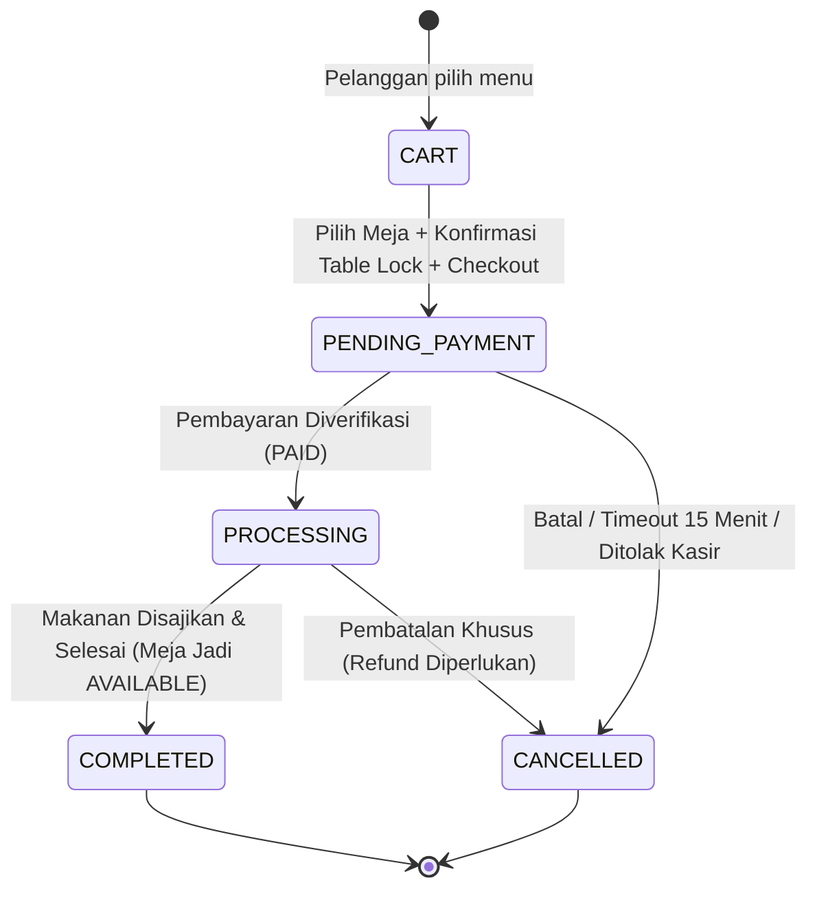
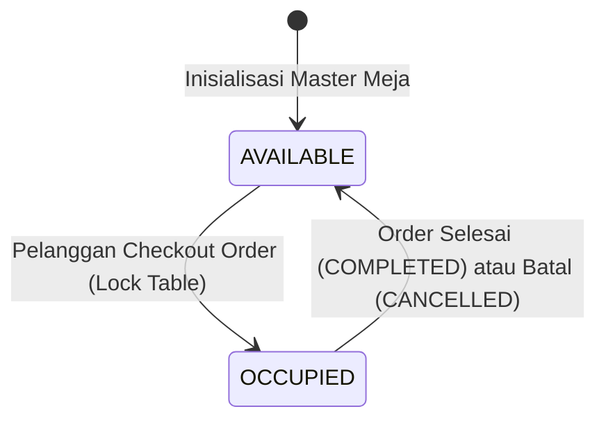
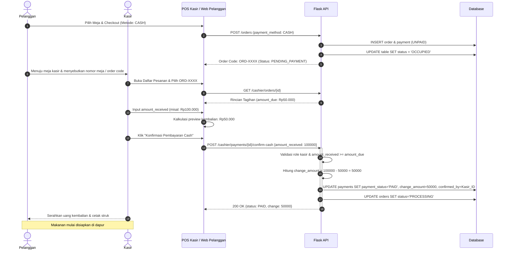
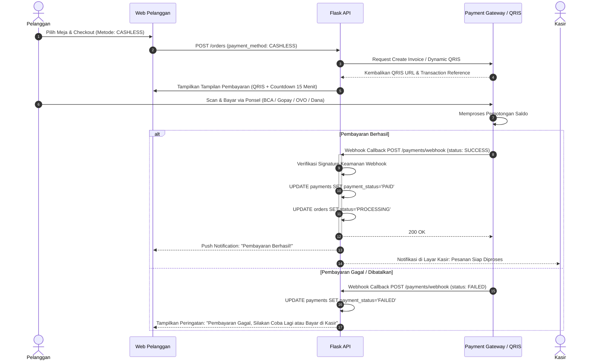
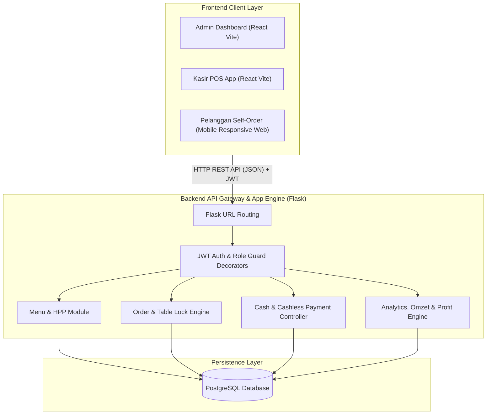
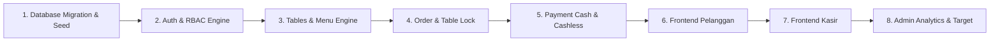

# Spesifikasi Desain & Dokumen Arsitektur: Sistem POS Restoran 3-Role (RBAC)

Dokumen ini mendokumentasikan spesifikasi arsitektur teknis, business rules, skema database, penanganan konflik, dan alur transaksi untuk sistem POS Restoran berbasis web dengan 3 peran pengguna (**Admin**, **Kasir**, **Pelanggan**) menggunakan Role-Based Access Control (RBAC).

---

## 1. Analisis Requirement

### 1.1 Ringkasan Sistem
Sistem ini adalah platform Point of Sale (POS) & Self-Ordering Restoran modern berbasis web. Sistem dirancang dengan pemisahan kewenangan yang tegas menggunakan pendekatan **Role-Based Access Control (RBAC)**:
*   **Admin**: Mengelola katalog menu, foto menu, penetapan HPP (modal per masakan), target penjualan bulanan, serta memantau omzet dan profit harian/periode.
*   **Kasir**: Mengelola antrean pesanan masuk, memverifikasi nomor meja, memproses pelunasan pembayaran Cash (dengan kalkulasi kembalian otomatis) dan Cashless, serta mengubah status order.
*   **Pelanggan**: Mengakses menu digital secara mandiri (*self-ordering*), memilih nomor meja yang tersedia, menyetujui pernyataan penguncian meja (*table lock confirmation*), membuat pesanan, memilih metode bayar, dan memantau status pesanan miliknya sendiri secara real-time.

### 1.2 Ruang Lingkup Sistem
*   **In-Scope**:
    *   Otentikasi & Otorisasi RBAC (Admin, Kasir, Pelanggan).
    *   Manajemen Meja (`tables`) dengan status `AVAILABLE` dan `OCCUPIED`.
    *   Manajemen Menu (`menus`) & Galeri Foto (`menu_images`) dengan soft-delete/status aktif.
    *   Pencatatan HPP/Modal statis per item menu untuk analisis profitabilitas.
    *   Dua metode pembayaran utama: `CASH` dan `CASHLESS`.
    *   State machine order (`CART`, `PENDING_PAYMENT`, `PROCESSING`, `COMPLETED`, `CANCELLED`).
    *   State machine pembayaran (`UNPAID`, `PENDING`, `PAID`, `FAILED`, `REFUNDED`).
    *   Laporan finansial: Omzet kotor, total HPP, Laba bersih (Profit), target bulanan.
*   **Out-of-Scope (DILARANG DIBUAT)**:
    *   Manajemen stok/inventaris barang atau bahan baku mentah (`inventory`, `stock`).
    *   Resep bertingkat / Bill of Materials (BOM) / `ingredients`.
    *   Sistem kasbon / piutang pelanggan (dihapus sepenuhnya).

### 1.3 Klarifikasi Ambiguitas & Rekomendasi Desain
1.  **Ambiguitas Registrasi Pelanggan vs Guest Checkout**:
    *   *Isu*: Apakah pelanggan harus membuat akun permanen dengan email/password atau cukup registrasi cepat?
    *   *Rekomendasi Final*: Mendukung **Quick Account / Phone-based Session** (Nama & No. HP/Email sederhana). Akun otomatis terdaftar dengan role `pelanggan` dan token JWT disimpan di LocalStorage/Cookie sesi pelanggan sehingga pelanggan memiliki `user_id` sah untuk relasi kepemilikan pesanan (*ownership check*).
2.  **Penanganan Menu Dinonaktifkan Saat Sudah Berada di Keranjang Pelanggan**:
    *   *Isu*: Admin menonaktifkan menu saat pelanggan sedang memilih di frontend.
    *   *Rekomendasi Final*: Saat checkout (`POST /orders`), server memvalidasi ulang status `is_available` dan `is_active` seluruh item. Jika ada menu yang tidak tersedia, checkout ditolak dengan pesan error spesifik meminta pelanggan memperbarui keranjang.
3.  **Abstraksi Metode Pembayaran Cashless**:
    *   *Isu*: Berbagai kanal pembayaran digital (QRIS, E-Wallet, VA).
    *   *Rekomendasi Final*: Kolom utama `payment_method` tetap bernilai enum `'CASHLESS'`. Rincian provider disimpan pada kolom opsional `payment_provider` (misal: `'QRIS'`, `'GOPAY'`) dan `payment_reference` (kode referensi / invoice gateway) tanpa memecah arsitektur dasar.

---

## 2. Potensi Konflik dan Solusi

Berikut adalah analisis 20 potensi konflik sistem beserta akar masalah, solusi, dan aturan finalnya:

| No | Potensi Konflik | Masalah | Penyebab | Solusi Teknis | Aturan Final |
|:---|:---|:---|:---|:---|:---|
| 1 | **Admin vs Kasir** (Perubahan Harga/HPP saat Transaksi) | Kasir memproses transaksi dengan harga lama, namun di laporan tercatat harga baru atau sebaliknya. | Admin mengubah harga jual/HPP menu di tabel master saat transaksi sedang berjalan di kasir. | Terapkan **Price & Cost Snapshot** pada tabel `order_items` (`price_at_order`, `cost_price_at_order`). | Harga dan HPP pada order yang sudah dibuat bersifat *immutable* (tidak berubah walau master menu diedit). |
| 2 | **Kasir vs Pelanggan** (Perubahan Item Pesanan) | Tagihan kasir berbeda dengan apa yang dilihat pelanggan di layar ponselnya. | Kasir menambah/mengurangi item pesanan atas permintaan lisan pelanggan, sementara pelanggan belum me-refresh halaman. | Perubahan item oleh kasir hanya diizinkan sebelum pembayaran (`status = PENDING_PAYMENT`). Setiap perubahan memicu event update order. | Kasir hanya boleh mengubah item jika status masih `PENDING_PAYMENT`. Total tagihan dihitung ulang otomatis oleh server. |
| 3 | **Admin vs Pelanggan** (Menu Dinonaktifkan) | Pelanggan memesan menu yang bahannya habis atau dinonaktifkan Admin. | Admin mengubah status menu menjadi tidak tersedia (`is_available = false`) saat menu sudah di keranjang pelanggan. | Validasi ketersediaan menu di tingkat server saat request checkout dibuat. | Jika salah satu menu tidak tersedia saat checkout, server mengembalikan status `400 Bad Request` dan transaksi dibatalkan. |
| 4 | **Order vs Payment** (Perubahan Order saat Payment Pending) | Nominal yang dibayar pada payment gateway tidak sesuai dengan total belanja pesanan. | Pelanggan atau kasir mengubah kuantitas item setelah instruksi pembayaran / QRIS diterbitkan. | Kunci order (`lock order items`): Kuantitas dan item pesanan dilarang dimodifikasi jika record `payments` dengan status `PENDING` sudah dibuat. | Untuk mengubah pesanan yang sudah memiliki payment pending, payment lama harus dibatalkan (`FAILED`/`CANCELLED`) terlebih dahulu. |
| 5 | **Cash vs Order** (Konfirmasi Fiktif Kasir) | Order diproses ke dapur padahal uang fisik belum diserahkan ke kasir. | Human error atau kelalaian kasir menekan tombol "Konfirmasi Bayar" sebelum menerima uang tunai. | UI Kasir mewajibkan pengisian `amount_received` yang valid sebelum tombol submit aktif. | Server menolak request konfirmasi cash jika parameter `amount_received` tidak dikirim atau bernilai 0. |
| 6 | **Cashless vs Order** (Klaim Sepihak Pelanggan) | Pesanan diproses hanya karena pelanggan menekan tombol "Saya Sudah Transfer". | Frontend pelanggan mengirim sinyal bayar tanpa verifikasi gateway/mutasi bank. | Status `PAID` untuk Cashless HANYA boleh diubah oleh webhook payment gateway terverifikasi atau verifikasi kasir via mutasi valid. | Tombol "Bayar" di frontend pelanggan tidak pernah langsung mengubah status payment menjadi `PAID`. |
| 7 | **Cashless vs Verifikasi Pembayaran** (Network Timeout / Delay Webhook) | Pelanggan sudah terdebet di e-wallet namun status order di sistem masih `PENDING`. | Gangguan jaringan antara bank/provider dengan server aplikasi. | Sediakan endpoint sinkronisasi manual `POST /cashier/payments/{id}/check-status` untuk memanggil API gateway langsung dari kasir. | Jika webhook terlambat, Kasir dapat memicu tombol "Cek Status Transaksi" untuk query langsung ke server payment provider. |
| 8 | **Payment vs Laporan** (Data Kotor / Pending Masuk Omzet) | Omzet dan profit di dashboard menggelembung padahal transaksi belum dibayar atau batal. | Query agregasi laporan menjumlahkan seluruh transaksi tanpa memfilter status pembayaran. | Filter agregasi laporan keuangan secara ketat: `WHERE payments.payment_status = 'PAID' AND orders.status IN ('PROCESSING', 'COMPLETED')`. | Transaksi dengan status `UNPAID`, `PENDING`, `FAILED`, atau `REFUNDED` mutlak TIDAK BOLEH dihitung ke dalam omzet dan profit. |
| 9 | **Harga & Transaksi Lama** | Nilai omzet bulan lalu berubah setelah Admin menaikkan harga menu hari ini. | Tabel transaksi melakukan join langsung ke tabel master `menus` untuk mengambil kolom harga. | Simpan snapshot harga jual pada setiap baris `order_items.price_at_order`. | Query laporan omzet hanya membaca kolom `order_items.subtotal` atau `order_items.price_at_order * quantity`, bukan dari tabel `menus`. |
| 10 | **HPP & Profit** | Transaksi tidak menghasilkan data profit atau menghasilkan profit fiktif/minus tak terduga. | Admin belum mengisi HPP atau mengubah HPP menu di masa depan. | Simpan `cost_price_at_order` pada `order_items`. Default HPP minimal 0 dan wajib diisi saat pembuatan menu. | Profit dihitung dari `(price_at_order - cost_price_at_order) * quantity` pada snapshot transaksi yang bersangkutan. |
| 11 | **Penghapusan Menu vs Histori Transaksi** | Laporan transaksi error (*Foreign Key Constraint Violation*) karena menu terkait telah dihapus dari database. | Admin melakukan `HARD DELETE` (`DELETE FROM menus WHERE id = X`) pada menu yang pernah dipesan sebelumnya. | Terapkan **Soft Delete** (`is_active = FALSE`, `deleted_at = TIMESTAMP`) pada tabel `menus`. Hindari hard delete data master. | Menu yang pernah ditransaksikan tidak boleh dihapus fisik dari database; hanya dinonaktifkan dari tampilan katalog. |
| 12 | **Pemilihan Meja & Order** | Pesanan masuk ke kasir tanpa identitas meja yang jelas. | Request pembuatan order dikirim langsung tanpa parameter `table_id`. | Validasi ketat di backend: `table_id` wajib ada (*NOT NULL*), status meja harus valid, dan meja harus berstatus `AVAILABLE`. | Order tidak dapat dibuat tanpa nomor meja yang terverifikasi di database. |
| 13 | **Perubahan Meja Setelah Order Dibuat** | Makanan diantar ke meja yang salah karena pelanggan berpindah tempat tanpa pemberitahuan. | Pelanggan berpindah meja secara fisik setelah memesan di aplikasi. | Tampilkan modal peringatan konfirmasi meja dengan checkbox wajib centang sebelum checkout. Kunci field `table_id` pada order. | Setelah checkout berhasil, pelanggan DILARANG MENGUBAH nomor meja melalui antarmuka web. Pemindahan meja hanya dapat dilakukan oleh Kasir/Admin. |
| 14 | **Dua Pelanggan Memilih Meja yang Sama** (Race Condition) | Dua pelanggan yang berbeda memesan di meja yang sama secara bersamaan dan pesanan bercampur. | Pelanggan A dan B membuka aplikasi pada waktu bersamaan saat status meja masih terlihat `AVAILABLE`. | Gunakan mekanisme **Database Locking** (`SELECT ... FOR UPDATE` atau pengecekan atomic status `OCCUPIED` saat checkout). | Siapa yang pertama kali menyelesaikan checkout sukses mengunci meja menjadi `OCCUPIED`. Pelanggan kedua akan menerima error: "Meja sudah digunakan". |
| 15 | **Order Dibatalkan & Status Meja** | Meja tetap berstatus `OCCUPIED` selamanya padahal pelanggan membatalkan pesanan. | Order dibatalkan (`CANCELLED`), tetapi logika pelepasan status meja terlewat. | Trigger/fungsi pembatalan order wajib mengeksekusi update status meja terkait menjadi `AVAILABLE` kembali. | Setiap kali order berpindah ke status `CANCELLED` atau `COMPLETED`, sistem otomatis memperbarui meja menjadi `AVAILABLE`. |
| 16 | **Pembayaran Cash Belum Dikonfirmasi** | Dapur memasak makanan, tetapi pelanggan pergi tanpa membayar ke kasir. | Dapur/Kasir memproses pesanan langsung saat status masih `PENDING_PAYMENT`. | Pisahkan status: Pesanan baru hanya berstatus `PENDING_PAYMENT`. Hanya order berstatus `PROCESSING` yang dikirim ke dapur. | Dapur hanya memproses order setelah status pembayaran berubah menjadi `PAID` (kecuali kebijakan resto mengizinkan pay-after-eat, di mana kasir tetap harus approval order). |
| 17 | **Uang Cash Kurang dari Total** | Transaksi tercatat lunas padahal toko mengalami kerugian kekurangan bayar. | Kasir salah menginput uang atau sengaja mengonfirmasi nominal yang kurang. | Server memvalidasi rumus: `IF amount_received < amount_due THEN RAISE EXCEPTION`. | Sistem menolak konfirmasi pembayaran cash jika nominal uang diterima kurang dari total tagihan (`400 Bad Request`). |
| 18 | **Uang Cash Lebih dari Total & Kembalian** | Kasir salah memberikan uang kembalian kepada pelanggan. | Perhitungan kembalian dilakukan manual di kalkulator eksternal oleh kasir. | Server dan frontend menghitung kembalian otomatis: `change_amount = amount_received - amount_due` dan mencatatnya ke database. | Nilai `change_amount` dihitung secara otoritatif oleh server dan wajib ditampilkan di modal konfirmasi serta struk belanja. |
| 19 | **Pembayaran Cashless Pending (Menggantung)** | Meja terkunci dan order menggantung karena pelanggan menutup browser sebelum membayar QRIS. | Pelanggan meninggalkan proses pembayaran cashless tanpa menyelesaikan transaksi. | Terapkan batas kedaluwarsa (*expiry time*, misal 15 menit). Sediakan cron/job background untuk membatalkan order expired. | Order cashless yang tidak dibayar dalam 15 menit otomatis diubah menjadi `CANCELLED` dan meja dilepas menjadi `AVAILABLE`. |
| 20 | **Pembayaran Cashless Gagal** | Pelanggan mengira pembayaran berhasil padahal saldo e-wallet gagal terpotong. | Saldo tidak cukup, PIN salah, atau transaksi ditolak oleh payment provider. | Terima callback `payment_status = FAILED` dari gateway, lalu beri opsi kepada pelanggan untuk mencoba ulang atau ganti ke Cash. | Order tetap berstatus `PENDING_PAYMENT` dengan opsi "Ulangi Pembayaran" atau "Ganti ke Pembayaran Cash di Kasir". |

---

## 3. Role & Permission Matrix (RBAC)

| Modul / Tindakan | Admin | Kasir | Pelanggan | Keterangan Aturan |
|:---|:---:|:---:|:---:|:---|
| **Katalog Menu** |
| Melihat Daftar Menu Aktif | ✅ | ✅ | ✅ | Pelanggan hanya melihat menu berstatus `is_available = TRUE`. |
| Menambah Menu Baru | ✅ | ❌ | ❌ | Khusus Admin. |
| Mengubah Data Menu & Foto | ✅ | ❌ | ❌ | Khusus Admin. |
| Menonaktifkan / Hapus Menu | ✅ | ❌ | ❌ | Soft delete (`is_active = FALSE`). |
| Mengatur Status Ketersediaan | ✅ | ✅ | ❌ | Kasir diizinkan mengubah status jika bahan habis dadakan. |
| **Harga & HPP** |
| Menentukan / Mengubah Harga Jual | ✅ | ❌ | ❌ | Khusus Admin. Kasir dilarang memanipulasi harga. |
| Menentukan / Mengubah HPP/Modal | ✅ | ❌ | ❌ | Khusus Admin. Sangat rahasia. |
| Melihat HPP/Modal Menu | ✅ | ❌ | ❌ | Kasir dan Pelanggan dilarang melihat HPP. |
| **Meja Restoran** |
| Melihat Daftar Seluruh Meja | ✅ | ✅ | ✅ | Pelanggan hanya melihat meja yang `AVAILABLE`. |
| Mengubah Nomor / Kapasitas Meja | ✅ | ❌ | ❌ | Konfigurasi denah/meja oleh Admin. |
| Memilih Meja untuk Order | ❌ | ✅ | ✅ | Kasir bisa memilihkan meja jika pesanan offline. |
| Memindahkan Meja Pelanggan | ✅ | ✅ | ❌ | Pelanggan dilarang ubah meja pasca-checkout. |
| **Pemesanan (Orders)** |
| Membuat Order Baru (Self-Order) | ❌ | ✅ | ✅ | Pelanggan via web; Kasir via POS counter. |
| Menambah/Kurangi Item di Order | ❌ | ✅ | ✅ | Pelanggan hanya saat di `CART`. Kasir sebelum `PAID`. |
| Melihat Pesanan Milik Sendiri | ✅ | ✅ | ✅ | Pelanggan dibatasi hanya order miliknya (`user_id`). |
| Melihat Seluruh Antrean Pesanan | ✅ | ✅ | ❌ | Dashboard kasir untuk seluruh meja. |
| Mengubah Status Order (`PROCESSING`) | ✅ | ✅ | ❌ | Dilakukan kasir setelah pembayaran sah. |
| Membatalkan Order (`CANCELLED`) | ✅ | ✅ | ❌ | Hanya oleh Kasir/Admin (dengan alasan pembatalan). |
| **Pembayaran (Payments)** |
| Memilih Metode Cash / Cashless | ❌ | ✅ | ✅ | Dipilih saat checkout oleh pelanggan atau kasir. |
| Menginput Uang Masuk Cash | ❌ | ✅ | ❌ | Kasir memegang kendali fisik uang laci. |
| Konfirmasi Pelunasan Cash (`PAID`) | ❌ | ✅ | ❌ | Kasir memverifikasi fisik uang. |
| Verifikasi Pelunasan Cashless (`PAID`)| ✅ | ✅ | ❌ | Otomatis via Gateway / Kasir cek mutasi. |
| Melihat Detail Bukti Bayar | ✅ | ✅ | ✅ | Pelanggan hanya melihat struk pembayarannya. |
| **Laporan & Target** |
| Melihat Omzet Total / Harian | ✅ | ❌ | ❌ | Khusus Admin. |
| Melihat Profit Harian & Periode | ✅ | ❌ | ❌ | Khusus Admin. Kasir tidak memiliki akses laba. |
| Mengatur Target Penjualan Bulanan | ✅ | ❌ | ❌ | Khusus Admin. |
| Memantau Capaian Target Bulanan | ✅ | ❌ | ❌ | Khusus Admin. |

---

## 4. Business Rules

1.  **Immutability Transaksi**:
    *   Setiap kali order beralih dari `CART` ke status berikutnya, rincian item belanja disalin sebagai snapshot: nama menu, harga satuan (`price_at_order`), dan HPP satuan (`cost_price_at_order`). Perubahan harga di masa depan tidak berdampak pada transaksi lama.
2.  **Kedaulatan Perhitungan Server (Server-Side Authority)**:
    *   Frontend dilarang mengirimkan nilai total, subtotal, kembalian, atau profit.
    *   Server mengambil harga dari database, menghitung `subtotal = price * quantity`, `total_amount = SUM(subtotal)`, `change_amount = amount_received - total_amount`, dan `profit = total_amount - SUM(cost_price * quantity)`.
3.  **Kriteria Transaksi Sah untuk Laporan**:
    *   Hanya transaksi dengan `payments.payment_status = 'PAID'` dan status pesanan `orders.status IN ('PROCESSING', 'COMPLETED')` yang diikutsertakan dalam kalkulasi Omzet dan Profit.
    *   Transaksi dengan status pembayaran `UNPAID`, `PENDING`, `FAILED`, atau `REFUNDED` mutlak diabaikan dari laporan performa.
4.  **Aturan Target Bulanan**:
    *   Target ditetapkan per bulan dan tahun (`month`, `year`).
    *   Persentase ketercapaian dihitung otomatis: `achievement_percentage = (omzet_berjalan / target_amount) * 100%`.

---

## 5. Aturan Meja (Table Management Rules)

1.  **Dua Status Meja Resmi**:
    *   `AVAILABLE`: Meja kosong, siap dipilih oleh pelanggan.
    *   `OCCUPIED`: Meja sedang digunakan oleh transaksi aktif (status order `PENDING_PAYMENT` atau `PROCESSING`).
2.  **Satu Meja Satu Order Aktif (Exclusive Table Lock)**:
    *   Sistem secara ketat menerapkan aturan: **Satu meja fisik hanya boleh memiliki satu order aktif dalam satu waktu**.
    *   Pencegahan tabrakan pesanan menggunakan transaksi database dengan isolation level memadai untuk mencegah *race conditions*.
3.  **Prosedur Table Lock & Warning**:
    *   Sebelum checkout, pelanggan wajib mencentang persetujuan:
        > *"Saya sudah memastikan nomor meja saya benar dan tidak akan berpindah meja selama transaksi berlangsung."*
    *   Setelah tombol "Lanjutkan Transaksi" diklik, sistem mengunci meja menjadi `OCCUPIED`.
4.  **Pelepasan Meja**:
    *   Status meja dikembalikan menjadi `AVAILABLE` secara otomatis ketika:
        *   Pesanan selesai disajikan dan dibayar (`COMPLETED`), ATAU
        *   Pesanan dibatalkan oleh kasir/sistem (`CANCELLED`).

---

## 6. Aturan Pembayaran Cash

```text
[Pelanggan Pilih CASH]
         │
         ▼
[Order Dibuat: status = PENDING_PAYMENT, Payment = UNPAID]
         │
         ▼
[Pelanggan Menuju Kasir & Menyerahkan Uang Fisik]
         │
         ▼
[Kasir Membuka Detail Pesanan & Memasukkan amount_received]
         │
         ├─── Jika amount_received < amount_due:
         │         └──> Sistem TOLAK Konfirmasi (Munculkan Peringatan "Uang Kurang")
         │
         └─── Jika amount_received >= amount_due:
                   ├──> Sistem Hitung: change_amount = amount_received - amount_due
                   ├──> Kasir Klik "Konfirmasi Pembayaran"
                   ├──> Server Update: Payment = PAID, Order = PROCESSING
                   ├──> Catat paid_at & confirmed_by (ID Kasir)
                   └──> Kasir Menyerahkan Kembalian & Cetak Struk
```

*   **Pencegahan Kecurangan**: Nilai `change_amount` dan status `PAID` dihitung serta diverifikasi pada layer backend. Kasir tidak bisa mem-bypass validasi uang kurang.

---

## 7. Aturan Pembayaran Cashless

```text
[Pelanggan Pilih CASHLESS]
         │
         ▼
[Order Dibuat: status = PENDING_PAYMENT, Payment = PENDING]
         │
         ▼
[Sistem Terbitkan Kode Bayar / Dynamic QRIS / Instruksi Transfer]
         │
         ▼
[Pelanggan Melakukan Pembayaran di Ponsel]
         │
         ├─── Kondisi A: Pembayaran Berhasil
         │         ├──> Webhook / Verifikasi API Gateway Berhasil
         │         ├──> Server Update: Payment = PAID, Order = PROCESSING
         │         └──> Notifikasi Real-time Muncul di Layar Kasir & Ponsel Pelanggan
         │
         ├─── Kondisi B: Waktu Habis / Timeout (15 Menit)
         │         ├──> Payment = FAILED
         │         ├──> Order = CANCELLED
         │         └──> Meja Otomatis Dilepas Menjadi AVAILABLE
         │
         └─── Kondisi C: Pembayaran Ditolak / Saldo Kurang
                   ├──> Payment = FAILED
                   └──> Pelanggan Diberi Opsi "Ulangi Bayar" atau "Ganti ke Cash di Kasir"
```

*   **Prinsip Utama**: Status `PAID` untuk cashless tidak pernah diubah hanya berdasarkan interaksi UI pengguna tanpa respons callback/verifikasi yang sah.

---

## 8. Skema Basis Data & ERD (Entity-Relationship Diagram)

```mermaid
erDiagram
    roles ||--o{ users : "assigned to"
    users ||--o{ orders : "places (as customer)"
    users ||--o{ payments : "confirms (as cashier)"
    users ||--o{ targets : "created by (as admin)"
    tables ||--o{ orders : "assigned to"
    menus ||--o{ menu_images : "has"
    menus ||--o{ order_items : "referenced in"
    orders ||--|{ order_items : "contains"
    orders ||--|| payments : "has"

    roles {
        int id PK
        string name UK "admin | cashier | customer"
        string description
    }

    users {
        int id PK
        int role_id FK
        string username UK
        string email UK
        string phone
        string password_hash
        string full_name
        boolean is_active
        datetime created_at
    }

    tables {
        int id PK
        string table_number UK "Contoh: Meja 01, Meja 02"
        string status "AVAILABLE | OCCUPIED"
        int capacity
        datetime updated_at
    }

    menus {
        int id PK
        string name
        text description
        string category "Makanan | Minuman | Cemilan"
        int price "Harga Jual"
        int cost_price "HPP / Modal"
        boolean is_available "Tersedia / Habis"
        boolean is_active "Soft Delete Flag"
        datetime created_at
        datetime updated_at
    }

    menu_images {
        int id PK
        int menu_id FK
        string image_url
        boolean is_primary
        datetime created_at
    }

    orders {
        int id PK
        string order_code UK "Format: ORD-YYYYMMDD-XXXX"
        int customer_id FK "References users.id"
        int table_id FK "References tables.id"
        string table_number_snapshot
        string status "CART | PENDING_PAYMENT | PROCESSING | COMPLETED | CANCELLED"
        int total_amount
        int total_cost "Total HPP Akumulasi"
        boolean table_confirmed
        text notes
        datetime created_at
        datetime updated_at
    }

    order_items {
        int id PK
        int order_id FK
        int menu_id FK
        string menu_name_snapshot
        int price_at_order
        int cost_price_at_order
        int quantity
        int subtotal
        int subtotal_cost
        text item_notes
    }

    payments {
        int id PK
        int order_id FK UK
        string payment_method "CASH | CASHLESS"
        string payment_status "UNPAID | PENDING | PAID | FAILED | REFUNDED"
        int amount_due
        int amount_received
        int change_amount
        string payment_provider "QRIS | GOPAY | BCA | MANUAL_CASH"
        string payment_reference "ID Transaksi Gateway"
        datetime paid_at
        int confirmed_by FK "References users.id (Kasir)"
        datetime created_at
        datetime updated_at
    }

    targets {
        int id PK
        int month "1 - 12"
        int year "2026"
        bigint target_amount "Target Omzet Rupiah"
        int created_by FK "References users.id"
        datetime created_at
        datetime updated_at
    }
```

---

## 9. Penjelasan Relasi Antar Tabel

1.  **`roles` ke `users` (1 to Many)**:
    *   Setiap pengguna hanya memiliki satu role utama (`admin`, `cashier`, atau `customer`) untuk menyederhanakan pengecekan otorisasi.
2.  **`tables` ke `orders` (1 to Many)**:
    *   Sebuah meja dapat memiliki banyak riwayat pesanan dari waktu ke waktu, tetapi **hanya boleh memiliki satu order aktif** pada saat yang sama (status `PENDING_PAYMENT` atau `PROCESSING`).
3.  **`menus` ke `menu_images` (1 to Many)**:
    *   Satu menu dapat memiliki satu atau lebih foto pendukung, dengan penanda `is_primary` untuk foto sampul utama pada katalog pelanggan.
4.  **`menus` ke `order_items` (1 to Many, Nullable on Soft Delete)**:
    *   Tabel `order_items` mencatat foreign key `menu_id`. Jika menu dinonaktifkan di master (`is_active = FALSE`), data historis di `order_items` tetap utuh karena field `menu_name_snapshot`, `price_at_order`, dan `cost_price_at_order` telah disalin permanen.
5.  **`orders` ke `order_items` (1 to Many, Cascade Delete hanya saat status `CART`)**:
    *   Satu pesanan memuat banyak item. Jika order masih berstatus `CART`, item dapat ditambah/dihapus secara bebas.
6.  **`orders` ke `payments` (1 to 1)**:
    *   Satu order terikat tepat pada satu entitas record pembayaran. Kolom `order_id` pada tabel `payments` bersifat `UNIQUE` untuk mencegah *double payment* pada satu tagihan yang sama.

---

## 10. Lifecycle & Status Order (Order Flow)

### 10.1 Definisi Status Order
*   `CART`: Keranjang belanja pelanggan sebelum konfirmasi meja dan checkout.
*   `PENDING_PAYMENT`: Pesanan telah dikunci meja dan menunggu proses pembayaran (Cash atau Cashless).
*   `PROCESSING`: Pembayaran telah diverifikasi `PAID`, pesanan masuk antrean dapur/penyiapan.
*   `COMPLETED`: Pesanan telah selesai disajikan dan meja telah dilepas.
*   `CANCELLED`: Pesanan dibatalkan (karena pembayaran kedaluwarsa atau dibatalkan kasir).

### 10.2 State Transition Diagram



### 10.3 Otoritas Perubahan Status Order
*   `CART` $\rightarrow$ `PENDING_PAYMENT`: Dilakukan oleh **Pelanggan** atau **Kasir**.
*   `PENDING_PAYMENT` $\rightarrow$ `PROCESSING`: Otomatis oleh **Sistem** saat pembayaran `PAID`.
*   `PROCESSING` $\rightarrow$ `COMPLETED`: Dilakukan oleh **Kasir** setelah pesanan tuntas disajikan.
*   `*` $\rightarrow$ `CANCELLED`: Dilakukan oleh **Kasir** atau **Admin** (atau timeout otomatis).

---

## 11. Lifecycle & Status Meja (Table Flow)



1.  **Pengecekan Ketersediaan**: Saat pelanggan membuka halaman pilih meja, sistem hanya menampilkan daftar meja dengan status `AVAILABLE`.
2.  **Penguncian (Locking)**: Saat order berhasil dibuat (`PENDING_PAYMENT`), `tables.status` diubah menjadi `OCCUPIED`.
3.  **Pelepasan (Release)**: Saat order bergeser ke `COMPLETED` atau `CANCELLED`, `tables.status` dikembalikan menjadi `AVAILABLE`.

---

## 12. Flow Pembayaran Cash (Sequence Diagram)



---

## 13. Flow Pembayaran Cashless (Sequence Diagram)



---

## 14. Alur Perhitungan HPP, Omzet, dan Profit

### 14.1 Rumus Perhitungan Matematis
1.  **Subtotal per Item**:
    $$\text{subtotal} = \text{price\_at\_order} \times \text{quantity}$$
2.  **Subtotal HPP (Modal) per Item**:
    $$\text{subtotal\_cost} = \text{cost\_price\_at\_order} \times \text{quantity}$$
3.  **Total Omzet per Transaksi**:
    $$\text{total\_amount} = \sum_{i=1}^{n} \text{subtotal}_i$$
4.  **Total HPP (Modal) per Transaksi**:
    $$\text{total\_cost} = \sum_{i=1}^{n} \text{subtotal\_cost}_i$$
5.  **Profit Bersih per Transaksi**:
    $$\text{profit} = \text{total\_amount} - \text{total\_cost}$$
6.  **Profit Harian**:
    $$\text{daily\_profit} = \sum \text{profit dari seluruh order berstatus PAID pada hari tersebut}$$
7.  **Persentase Capaian Target Bulanan**:
    $$\text{target\_achievement} = \left( \frac{\text{total\_omzet\_bulan\_ini}}{\text{target\_amount}} \right) \times 100\%$$

---

## 15. Arsitektur Sistem

Sistem mengadopsi pola **Decoupled Client-Server**:



---

## 16. Spesifikasi API / Endpoint

Semua endpoint diawali dengan `/api`. Semua response mengembalikan payload berformat JSON standar: `{ "success": boolean, "data": ..., "message": ... }`.

### 16.1 Modul Otentikasi (`/api/auth`)
*   `POST /api/auth/register`: Pendaftaran akun (default role: `customer`).
*   `POST /api/auth/login`: Login seluruh user $\rightarrow$ mengembalikan JWT Token & Role object.
*   `GET /api/auth/me`: Mengambil profil pengguna yang sedang login berdasarkan token Bearer.

### 16.2 Modul Meja (`/api/tables`)
*   `GET /api/tables`: Mengambil seluruh daftar meja (Akses: Admin, Kasir).
*   `GET /api/tables/available`: Mengambil meja yang kosong saja (Akses: Publik / Pelanggan).
*   `POST /api/tables`: Menambah meja baru (Akses: Admin).
*   `PUT /api/tables/{id}`: Mengubah konfigurasi meja (Akses: Admin).

### 16.3 Modul Menu (`/api/menus` & `/api/admin/menus`)
*   `GET /api/menus`: Mengambil daftar menu aktif untuk pelanggan (HPP disembunyikan).
*   `GET /api/admin/menus`: Mengambil seluruh menu lengkap beserta HPP dan status aktif (Akses: Admin).
*   `POST /api/admin/menus`: Menambah menu baru beserta harga jual & HPP (Akses: Admin).
*   `PUT /api/admin/menus/{id}`: Mengubah data menu, foto, harga, dan HPP (Akses: Admin).
*   `PATCH /api/menus/{id}/toggle-availability`: Mengubah status tersedia/habis (Akses: Admin, Kasir).
*   `DELETE /api/admin/menus/{id}`: Soft delete menu (Akses: Admin).

### 16.4 Modul Pemesanan (`/api/orders`)
*   `POST /api/orders`: Membuat pesanan baru (Akses: Pelanggan, Kasir).
    *   *Payload*: `{ "table_id": 1, "payment_method": "CASH"|"CASHLESS", "table_confirmed": true, "items": [{"menu_id": 1, "quantity": 2, "notes": "Pedas"}] }`
*   `GET /api/orders/{id}`: Mengambil detail order (Akses: Kasir, Admin, Pelanggan pemilik order).
*   `GET /api/orders/my-orders`: Riwayat pesanan milik pelanggan yang sedang login.
*   `GET /api/cashier/orders`: Antrean seluruh pesanan aktif (Akses: Kasir, Admin).
*   `PATCH /api/cashier/orders/{id}/status`: Memperbarui status pesanan (`PROCESSING` / `COMPLETED` / `CANCELLED`) (Akses: Kasir).

### 16.5 Modul Pembayaran (`/api/payments`)
*   `POST /api/cashier/payments/{paymentId}/confirm-cash`:
    *   *Akses*: Kasir.
    *   *Payload*: `{ "amount_received": 100000 }`
    *   *Validasi*: Role kasir sah, `payment_method == 'CASH'`, status pembayaran belum lunas, nominal `amount_received >= amount_due`.
*   `POST /api/payments/webhook`: Webhook callback publik untuk notifikasi status pembayaran Cashless.
*   `GET /api/payments/{paymentId}/status`: Cek status pembayaran terkini (Akses: Pelanggan, Kasir).

### 16.6 Modul Laporan & Target (`/api/admin`)
*   `GET /api/admin/reports/summary`: Ringkasan omzet, total HPP, profit bersih, dan pemisahan transaksi Cash vs Cashless (Akses: Admin).
*   `GET /api/admin/reports/profit-daily`: Data profit per hari untuk grafik/tren (Akses: Admin).
*   `GET /api/admin/transactions`: Riwayat transaksi terperinci (Akses: Admin).
*   `GET /api/admin/targets`: Mengambil target penjualan bulanan & capaian riil (Akses: Admin).
*   `POST /api/admin/targets`: Menetapkan target omzet bulanan baru (Akses: Admin).

---

## 17. Struktur Halaman Frontend

### 17.1 Antarmuka Pelanggan (Customer Mobile-First UI)
1.  **Halaman Pemilihan Meja (`/table-selection`)**:
    *   Grid kartu nomor meja dengan badge warna status (`Tersedia` hijau, `Terisi` abu-abu).
    *   Setelah nomor meja dipilih, muncul modal konfirmasi dengan peringatan: *"Pastikan Anda sudah berada di meja yang benar. Anda tidak diperbolehkan berpindah meja."* + Checkbox persetujuan wajib.
2.  **Halaman Katalog Menu (`/menu`)**:
    *   Navbar sticky menampilkan info: Nomor Meja terpilih & Ikon Keranjang.
    *   Tab filter kategori (Semua, Makanan, Minuman, Cemilan).
    *   Kartu menu dengan foto, nama, deskripsi, harga jual, dan tombol "+ Tambah".
3.  **Halaman Keranjang & Checkout (`/checkout`)**:
    *   Daftar item terpilih, kontrol tombol minus/plus kuantitas, input catatan per item.
    *   Pilihan radio button metode pembayaran: `CASH (Bayar di Kasir)` vs `CASHLESS (QRIS/E-Wallet)`.
    *   Tombol "Konfirmasi & Pesan Sekarang".
4.  **Halaman Status Pesanan (`/order-status/:id`)**:
    *   Status visual pesanan (Menunggu Pembayaran $\rightarrow$ Sedang Dimasak $\rightarrow$ Selesai).
    *   Instruksi pembayaran cash/QRIS barcode (jika cashless).

### 17.2 Antarmuka Kasir (Cashier POS Desktop UI)
1.  **Halaman Antrean Pesanan (`/cashier/orders`)**:
    *   Tampilan kartu/kolom pesanan masuk terorganisir berdasarkan status: `Menunggu Pembayaran`, `Sedang Diproses`, `Siap Saji`.
    *   Label nomor meja kontras tinggi di setiap kartu pesanan.
2.  **Modal Pemrosesan Pembayaran Cash**:
    *   Menampilkan ringkasan total tagihan (`amount_due`).
    *   Input uang tunai diterima (`amount_received`) dengan tombol cepat pecahan uang (Rp20.000, Rp50.000, Rp100.000, Uang Pas).
    *   Kalkulator kembalian otomatis real-time.
    *   Tombol "Terima & Konfirmasi Pembayaran" (disabled jika nominal kurang).
3.  **Modal Verifikasi Cashless**:
    *   Menampilkan status terkini pembayaran cashless (Pending / Success).
    *   Tombol manual "Cek Status Terkini / Refresh".
4.  **Riwayat Transaksi Kasir (`/cashier/history`)**:
    *   Tabel transaksi hari ini, pencarian nomor struk, tombol cetak ulang struk nota.

### 17.3 Antarmuka Admin (Admin Analytics & Management UI)
1.  **Dashboard Utama (`/admin/dashboard`)**:
    *   Kartu KPI: Omzet Hari Ini, Profit Hari Ini, Total Transaksi Cash vs Cashless.
    *   Progress Bar Target Bulanan: Target Rp X, Capaian Rp Y (Z%).
    *   Grafik tren penjualan harian dalam rentang 30 hari terakhir.
2.  **Manajemen Menu (`/admin/menus`)**:
    *   Tabel master menu: Foto, Nama, Kategori, Harga Jual, HPP/Modal, Margin Keuntungan (Rp & %), Status Ketersediaan, Aksi.
    *   Modal Tambah/Edit Menu dengan upload foto dan input HPP.
3.  **Laporan Transaksi & Profit (`/admin/reports`)**:
    *   Filter laporan berdasarkan rentang tanggal dan metode pembayaran.
    *   Rincian detail setiap transaksi hingga ke subtotal HPP dan profit bersih per item.
4.  **Pengaturan Target Penjualan (`/admin/targets`)**:
    *   Form input target omzet bulanan dan pemantauan riwayat target masa lalu.

---

## 18. Keamanan & Kedaulatan Server (Security Checklist)

1.  **Authentication & Password Hashing**:
    *   Password disimpan menggunakan algoritma **Bcrypt** dengan salt rounds minimal 12.
    *   Token otentikasi menggunakan stateless **JWT (JSON Web Token)** dengan algoritma `HS256`, masa kedaluwarsa 24 jam, dan memuat `user_id` serta `role`.
2.  **Role Guard Middleware (RBAC)**:
    *   Decorator `@roles_required(['admin'])` dan `@roles_required(['cashier', 'admin'])` dipasang di setiap endpoint sensitif. Request tanpa token valid atau dengan role yang tidak berhak langsung mengembalikan status `403 Forbidden`.
3.  **Ownership Check (Proteksi Data Pelanggan)**:
    *   Pelanggan dilarang mengakses riwayat pesanan milik pelanggan lain. Endpoint `/api/orders/{id}` memverifikasi apakah `order.customer_id == current_user.id` (kecuali jika pemanggil memiliki role `cashier` atau `admin`).
4.  **Pencegahan Manipulasi Finansial Frontend**:
    *   Nilai `subtotal`, `total_amount`, `amount_due`, `change_amount`, dan `profit` tidak pernah dipercaya dari payload request frontend. Seluruh angka finansial dihitung murni di backend dari database.
5.  **Pencegahan Double-Booking Meja (Concurrency Control)**:
    *   Eksekusi query penguncian meja menggunakan blok transaksi ACID dengan klausa `SELECT ... FOR UPDATE` pada baris tabel `tables`. Jika dua pelanggan mengklik checkout pada detik yang sama untuk meja yang sama, transaksi kedua otomatis gagal dan di-rollback.

---

## 19. Rekomendasi Teknologi

Stack teknologi dipilih berdasarkan prinsip: **sederhana, tidak overengineering, ramah pengembang, dan telah terpasang dengan baik pada repositori saat ini**:

1.  **Backend**:
    *   **Python 3.11 + Flask**: Sangat ringan, mudah dipahami developer pemula, dan struktur kode modular via *Flask Blueprints*.
    *   **SQLAlchemy ORM**: Abstraksi database yang tangguh dan aman dari celah SQL Injection.
    *   **PyJWT & Bcrypt**: Standar industri untuk otentikasi stateless dan enkripsi kata sandi.
2.  **Frontend**:
    *   **React 18 + Vite**: Cepat, reaktif, dan performa tinggi untuk antarmuka kasir yang responsif.
    *   **Tailwind CSS**: Desain UI modern, fleksibel, mudah dikustomisasi, dan ramah tampilan mobile untuk pelanggan.
    *   **Lucide React**: Ikonografi antarmuka yang bersih dan konsisten.
    *   **Axios**: HTTP client dengan konfigurasi *interceptor* otomatis untuk header Bearer JWT.
3.  **Database**:
    *   **PostgreSQL 15**: Database relasional dengan integritas data referensial ketat (ACID) yang sangat cocok untuk transaksi keuangan dan penguncian baris meja.
4.  **Orkestrasi**:
    *   **Docker & Docker Compose**: Menyatukan service Database, Backend, dan Frontend dalam satu perintah `docker compose up`.

---

## 20. Urutan Implementasi (Step-by-Step Roadmap)

Implementasi dibagi menjadi 8 fase terstruktur:



1.  **Fase 1: Pembersihan Skema Lama & Migrasi Database Baru**:
    *   Hapus modul tabel lama: `expenses`, `debt_payments`, `customers` (kasbon), dan kolom-kolom inventaris/stok rokok eceran.
    *   Buat tabel baru sesuai skema: `roles`, `users`, `tables`, `menus`, `menu_images`, `orders`, `order_items`, `payments`, `targets`.
    *   Buat file seed database untuk membuat 3 role standar (`admin`, `cashier`, `customer`), user demo Admin & Kasir, serta 10 data meja (`Meja 01` s/d `Meja 10`).
2.  **Fase 2: Otentikasi & RBAC Middleware**:
    *   Implementasi decorator `@token_required` dan `@roles_required(['role1', 'role2'])`.
    *   Testing endpoint login dan verifikasi pembatasan akses masing-masing role.
3.  **Fase 3: API Manajemen Meja & Katalog Menu**:
    *   CRUD Menu lengkap dengan field `price` dan `cost_price` (HPP) untuk Admin.
    *   Endpoint katalog menu publik untuk Pelanggan (dengan proteksi HPP disembunyikan).
    *   Endpoint status meja (`AVAILABLE` vs `OCCUPIED`).
4.  **Fase 4: Core Engine Pemesanan & Table Lock**:
    *   Implementasi pembuatan order dengan validasi checklist meja, pencatatan snapshot harga/HPP, dan penguncian status meja menjadi `OCCUPIED`.
5.  **Fase 5: Core Engine Pembayaran (Cash & Cashless)**:
    *   Endpoint konfirmasi cash kasir dengan kalkulasi kembalian otomatis dan validasi uang cukup.
    *   Endpoint handler pembayaran cashless (mock provider / QRIS payload) dan update status menjadi `PAID`.
    *   Trigger otomatis update order menjadi `PROCESSING`.
6.  **Fase 6: Pembangunan Antarmuka Pelanggan (Customer Self-Ordering)**:
    *   Alur UI: Pilih Meja $\rightarrow$ Peringatan Meja $\rightarrow$ Pilih Menu $\rightarrow$ Keranjang $\rightarrow$ Pilih Pembayaran $\rightarrow$ Layar Status Pesanan.
7.  **Fase 7: Pembangunan Antarmuka Kasir (Cashier POS)**:
    *   Tampilan antrean pesanan masuk, modal pembayaran cash cepat dengan kalkulator kembalian, dan kontrol status pesanan selesai/batal.
8.  **Fase 8: Dashboard Admin, Analitik Omzet/Profit & Target Bulanan**:
    *   Kalkulasi agregasi omzet kotor, total HPP, profit harian/periode, dan grafik perbandingan realisasi omzet terhadap target bulanan.
    *   Pengujian menyeluruh end-to-end (E2E).
